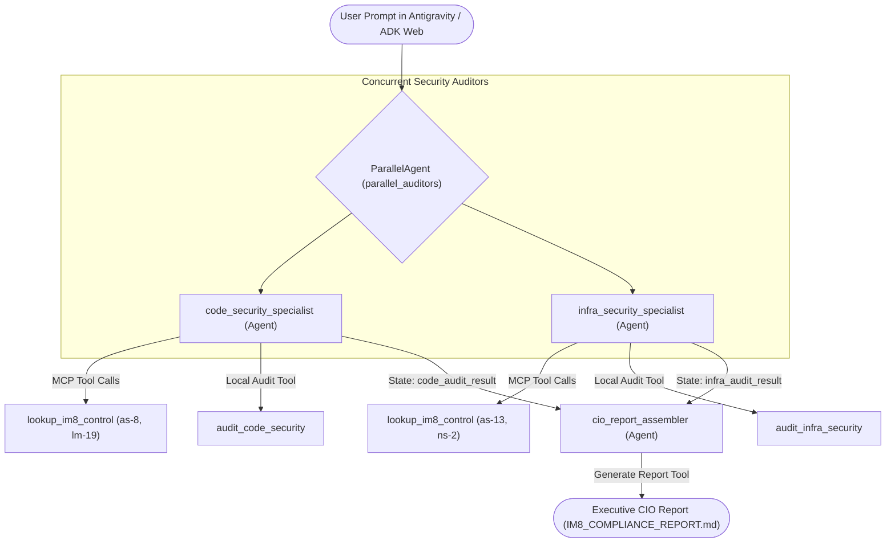

id: build-parallel-multiagent-im8-compliance-assistant
summary: Build an autonomous parallel multi-agent IM8 compliance and remediation companion with Antigravity, ADK, and MCP.
categories: AI, Cloud, Security, Government
environments: Web
status: Draft
authors: Weizhong Toh
tags: Antigravity, ADK, MCP, Gemini, IM8, GovTech

# Build an Autonomous IM8 Compliance & Remediation Companion with Antigravity, ADK & MCP

## 1. Overview & Objectives
Duration: 0:02:00

In this codelab, you step into the role of an **Agent Creator**. 

Rather than manually auditing software repositories, you instruct **Antigravity 2.0** to build an autonomous compliance companion. The system is built with the **Google Agent Development Kit (ADK)** and the **Model Context Protocol (MCP)**, powered by **Gemini 2.5 Flash**.

The agent system audits application source code and cloud infrastructure against Singapore Government **Instruction Manual 8 (IM8)** standards. It identifies security violations, executes automated code repairs, and generates an executive attestation report for the Agency Chief Information Officer (CIO).

### Multi-Agent Parallel Orchestration Architecture
This diagram illustrates how incoming audit requests run concurrently across specialized security agents before synthesizing into the CIO attestation report:



### 🚀 The Antigravity Way: Agentic Software Engineering
Traditionally, software tutorials require manual typing and copy-pasting code blocks. In this codelab, you pair-program with the **Antigravity Agent**. You write **prompts** to guide the agent in building, testing, and verifying the multi-agent system.

The lab has two phases.

1. **Build phase (steps 3 to 6)**: You prompt Antigravity to write the policy database, the FastMCP server, the audit tools, and the agent pipeline. Each build step gives you the exact prompt and the reference code to check against.
2. **Run phase (steps 7 to 10)**: You start the ADK web interface, then drive the audit and the repair from its chat panel. You watch each agent step and each tool call as it happens.

### What You Will Learn
* How to pair-program with Antigravity 2.0 using natural language prompts.
* How to serve a real, public government control catalog through a FastMCP server.
* How to build concurrent security auditors with Google ADK `ParallelAgent`.
* How to synthesize multi-agent findings using a sequential `cio_report_assembler`.
* How to run and inspect the pipeline in the visual ADK web interface (`adk web`).
* How to make a repair tool prove its work instead of assuming success.
* How to cite a real control and refuse to invent one.

---

## 2. Explore the Target Codebase and the IM8 Reform Controls
Duration: 0:04:00

Your workspace holds a mock Singapore public sector service in `sample_target_repo/`.

### Where the controls come from

The full Instruction Manual 8 is not a public document. It sits behind a
government portal and needs authorised credentials.

Under the IM8 Reform programme, GovTech publishes a control catalog for
low-risk cloud systems. That catalog is public and open source. This lab uses
four controls from it.

* Repository: [GovTechSG/tech-standards](https://github.com/GovTechSG/tech-standards)
* File: `catalogs/im8-reform.json`, version 2025.05.13
* Licence: MIT, Government Technology Agency of Singapore

Positive : The catalog uses OSCAL, an open control format from NIST. Because the controls are machine readable, an agent can read them directly instead of reading prose.

Negative : Do not invent a control identifier. If a control is not in the public catalog, do not cite it. A false citation in a compliance report is worse than no report.

### The four controls and the four defects

| Control | Title | Profile | Defect planted in the repository |
|---|---|---|---|
| `as-8` | Secrets Management | Level 1 | `service/config.yaml` holds the static key `apex-sec-prod-9841294812`. |
| `lm-19` | Log Sanitisation | Level 2 | `service/app.py` writes the citizen identity number and telephone number to the log in plaintext. |
| `as-13` | Exposure of Internal System Details | Level 2 | `service/app.py` serves `/api/v1/debug/dump-records` with no authentication. |
| `ns-2` | Access Restrictions on CSP Resources Outside Virtual Network | Level 1 | `infra/terraform/storage.tf` sets `public_access_prevention` to `inherited` and grants object read to `allUsers`. |

The profile column records the low-risk cloud profile that carries the control.
Level 0 is a must-have, Level 1 is a should-have, and Level 2 is a good-to-have.

---

## 3. Seed the Control Database
Duration: 0:05:00

Store the four controls in a local SQLite database, `im8_policies.db`.

### 🤖 The Agentic Prompt (Antigravity)
Open the **Antigravity Chat Panel** and enter this prompt:

```text
Fetch https://raw.githubusercontent.com/GovTechSG/tech-standards/master/catalogs/im8-reform.json. It is the public Singapore Government IM8 Reform control catalog in OSCAL format.

Create init_im8_db.py. It must build a SQLite database im8_policies.db with two tables:
1. im8_controls: control_id, title, control_group, profile_level, statement, guidance, source.
2. remediation_templates: control_id, file_type, vulnerable_pattern, compliant_replacement, explanation.

Seed im8_controls with exactly four controls taken from the catalog: as-8, lm-19, as-13 and ns-2. Copy the real statement and the real guidance. Do not paraphrase them and do not invent any control.

Record the source as the catalog file and its version. Add a module docstring that names the repository, the file, the version and the MIT licence.

Seed remediation_templates with a repair example for each control, and mark in the comments that these templates are written for this lab and are not part of the catalog.

Then run the script.
```

### 📄 What the agent produces

The database holds four rows. Each row carries the real control statement. For
example, `as-8` states: "Securely store secrets in an appropriate secrets
management solution with access control enforcement, encryption, and
monitoring."

---

## 4. Build the FastMCP Control Catalog Server
Duration: 0:08:00

Next, expose the control database through the **Model Context Protocol (MCP)** using `FastMCP`. The server reads `im8_policies.db` and offers tools that look up a control and its repair template.

This is the reason MCP belongs in this lab. Government control text changes on its own schedule. Putting it behind MCP lets an agency update a control without touching the agent code.

### 🤖 The Agentic Prompt (Antigravity)
Enter the following prompt in the Antigravity chat panel:

```text
Create an MCP server script named mcp_im8_server.py using FastMCP. The server must read im8_policies.db and expose three tools: lookup_im8_control(control_id: str) -> str, list_im8_controls() -> str, and get_remediation_pattern(control_id: str) -> str. lookup_im8_control must return the title, the group, the profile level, the statement, the guidance and the source. Give each tool a clear docstring and error handling. When run directly, serve over stdio transport.
```

### 📄 Expected Reference Code
Antigravity creates `mcp_im8_server.py`:

```python
import os
import sqlite3
import sys
from mcp.server.fastmcp import FastMCP

mcp = FastMCP("IM8ControlCatalog")
DB_FILE = os.path.join(os.path.dirname(__file__), "im8_policies.db")

@mcp.tool()
def lookup_im8_control(control_id: str) -> str:
    """Look up one control from the public IM8 Reform catalog."""
    conn = sqlite3.connect(DB_FILE)
    cursor = conn.cursor()
    cursor.execute(
        "SELECT control_id, title, control_group, profile_level, statement, "
        "guidance, source FROM im8_controls WHERE LOWER(control_id) = LOWER(?)",
        (control_id.strip(),))
    row = cursor.fetchone()
    conn.close()
    if row:
        return f"Control ID: {row[0]}\nTitle: {row[1]}\nProfile Level: {row[3]}\nStatement: {row[4]}"
    return f"Control '{control_id}' is not in the local catalog."

@mcp.tool()
def list_im8_controls() -> str:
    """List every control held in the local IM8 Reform catalog."""
    ...

@mcp.tool()
def get_remediation_pattern(control_id: str) -> str:
    """Return the repair template written for one control."""
    ...

if __name__ == "__main__":
    mcp.run(transport="stdio")
```

---

## 5. Implement Audit and Remediation Tools
Duration: 0:08:00

We now build the native Python scanning and automated repair tools that inspect and modify `sample_target_repo/`.

### 🤖 The Agentic Prompt (Antigravity)
Enter the following prompt in the Antigravity chat panel:

```text
In app/tools.py, write four functions:
1. audit_code_security(target_repo: str = "sample_target_repo", remediate: bool = False) -> str: Checks service/config.yaml for a static credential (control as-8) and service/app.py for unmasked identity and telephone numbers in the log (control lm-19). When remediate is True, it replaces the secret with ${APEX_SERVICE_KEY} and applies NRIC masking.
2. audit_infra_security(target_repo: str = "sample_target_repo", remediate: bool = False) -> str: Checks service/app.py for an unauthenticated debug route (control as-13) and infra/terraform/storage.tf for a public bucket grant (control ns-2). Match both google_storage_bucket_iam_binding with a members list and google_storage_bucket_iam_member with a single member field. When remediate is True, it removes the debug endpoint and enforces private bucket access.
3. generate_cio_report(report_content: str, output_path: str = "IM8_COMPLIANCE_REPORT.md") -> str: Writes the CIO attestation report to disk.
4. get_assessment_timestamp() -> str: Returns the current date and time in Singapore Standard Time.

After every repair, read the file back and test it against the defect pattern again. Report REMEDIATION FAILED when the defect remains. Also remove the planted comment lines that start with VIOLATION or Non-compliant, so a repaired file does not carry a stale warning.
```

Negative : A repair tool must never report success from the fact that it ran. It must prove the defect is gone. An audit tool that reports a repair it did not make is worse than no tool, because it produces a false attestation.

### 📄 Expected Reference Code
Antigravity creates `app/tools.py` with typed tools, regex repair patterns, and a read-back check after each write.

Positive : Ask Antigravity to run each tool directly against `sample_target_repo` before you wire it into an agent. Then restore the files with `git checkout`. A tool that fails on its own will also fail inside the pipeline.

---

## 6. Build the Parallel Multi-Agent Pipeline
Duration: 0:10:00

We orchestrate the specialist agents into an ADK pipeline:
* `code_security_specialist`: Focuses on application code. Uses MCP policy tools and `audit_code_security`.
* `infra_security_specialist`: Focuses on cloud infrastructure. Uses MCP policy tools and `audit_infra_security`.
* `parallel_auditors`: Runs both specialist agents concurrently with `ParallelAgent`.
* `cio_report_assembler`: Gathers findings and writes `IM8_COMPLIANCE_REPORT.md`.

### 🤖 The Agentic Prompt (Antigravity)
Enter the following prompt in the Antigravity chat panel:

```text
In app/agent.py, construct a multi-agent ADK pipeline. Connect to mcp_im8_server.py using McpToolset with StdioConnectionParams. Create two specialist agents: code_security_specialist handles as-8 and lm-19, and infra_security_specialist handles as-13 and ns-2. Give both the MCP control tools and their own audit tool. Instruct each one to call lookup_im8_control first and to quote the real statement. Tell them never to invent a control identifier. Group them under a ParallelAgent named parallel_auditors. Then create a sequential step with cio_report_assembler. Give it generate_cio_report and get_assessment_timestamp. Instruct it to read the real date from the clock tool and never guess a date. It must write COMPLIANT only when every rule reports COMPLIANT or REMEDIATED. Bundle the pipeline into SequentialAgent and export app = App(root_agent=root_agent, name="app").
```

### 📄 Expected Reference Code
Antigravity constructs `app/agent.py`:

```python
from google.adk.agents import Agent, ParallelAgent, SequentialAgent
from google.adk.apps import App
from google.adk.tools.mcp_tool import McpToolset
from app.tools import audit_code_security, audit_infra_security, generate_cio_report

# Parallel Specialist Auditors
parallel_auditors = ParallelAgent(
    name="parallel_auditors",
    sub_agents=[code_security_agent, infra_security_agent]
)

# Executive Report Assembler
assembler_agent = Agent(
    name="cio_report_assembler",
    output_key="cio_report",
    tools=[generate_cio_report]
)

# Complete Sequential Pipeline
im8_pipeline = SequentialAgent(
    name="im8_pipeline",
    sub_agents=[parallel_auditors, assembler_agent]
)

root_agent = im8_pipeline
app = App(root_agent=root_agent, name="app")
```

---

## 7. Launch the ADK Web Interface
Duration: 0:04:00

Google ADK includes a visual web interface. It shows each agent step and each tool call as the pipeline runs. You will drive the audit and the repair from this interface.

### Launch Command
In your terminal, start the local ADK web server from the project root:

```bash
adk web
```

Open your browser at:
```text
http://localhost:8000
```

### Select the Agent
In the navigation menu on the left, select the `app` agent. The chat input appears on the right.

Negative : Start `adk web` from the project root, not from inside `app/`. The audit tools resolve `sample_target_repo` against the working directory of the server process.

Positive : Keep the terminal open. The FastMCP policy server starts as a child process of the web server. Its errors print in that terminal.

---

## 8. Audit the Target Repository in Scan Mode
Duration: 0:04:00

First run the pipeline in audit-only mode. Nothing is modified in this step.

### Prompt in the ADK Web Chat
Type this prompt into the chat input:

```text
Audit sample_target_repo for IM8 compliance. Do not remediate anything. Report every violation you find across code and infrastructure.
```

### What to Watch in the Interface
1. Open the trace or events panel.
2. Both `code_security_specialist` and `infra_security_specialist` start in the same turn. They run concurrently under `parallel_auditors`.
3. Each specialist calls `lookup_im8_control` on the FastMCP server to read the real control statement.
4. Each specialist then calls its audit tool with `remediate: false`.
5. `cio_report_assembler` runs last, after both specialists finish.

### Expected Findings
The parallel auditors report all four defects:
* **as-8**: static credential in `service/config.yaml`.
* **lm-19**: unmasked identity and telephone numbers logged in `service/app.py`.
* **as-13**: unauthenticated `/api/v1/debug/dump-records` route in `service/app.py`.
* **ns-2**: public bucket grant in `infra/terraform/storage.tf`.

The overall status is `NON-COMPLIANT`.

---

## 9. Remediate the Violations in the Same Interface
Duration: 0:05:00

Now repair the defects. Use the same chat session, so the agents keep the context of the audit.

### Prompt in the ADK Web Chat
Type this prompt into the chat input:

```text
Remediate every violation in sample_target_repo now. Repair the code, the configuration, and the infrastructure files. Then write the CIO attestation report.
```

### What to Watch in the Interface
1. Both specialists now call their audit tools with `remediate: true`.
2. Each tool reads the repaired file back and checks it against the defect pattern.
3. `cio_report_assembler` calls `get_assessment_timestamp` before it writes the report.
4. The report status changes to `COMPLIANT`.

### Verify the Repair
Run the audit prompt from step 8 one more time. Every rule must now report `COMPLIANT`.

Then open each file and read it:
1. `service/config.yaml`: the hardcoded key is replaced by `${APEX_SERVICE_KEY}`.
2. `service/app.py`: the citizen NRIC and phone number are masked before logging.
3. `service/app.py`: the public debug route is removed.
4. `infra/terraform/storage.tf`: bucket access is `enforced` and the `allUsers` grant is gone.

Negative : Do not trust the REMEDIATED message on its own. Open each file and read it. A codelab teaches you to verify, not to assume.

Positive : To repeat the lab, restore the defects with `git checkout -- sample_target_repo`.

---

## 10. Review the Executive CIO Attestation Report
Duration: 0:02:00

Open the generated report in your editor:
```text
IM8_COMPLIANCE_REPORT.md
```

### Sample Report Contents
* **Assessment Scope**: Target repository path and audit timestamp.
* **Overall Posture**: `COMPLIANT (REMEDIATED)`.
* **Deployment Recommendation**: `APPROVED for Government Commercial Cloud (GCC) deployment.`
* **Itemized Control Matrix**: Itemized record of all 4 IM8 rules and remediation actions.

---

## 11. Summary & Next Steps
Duration: 0:02:00

Congratulations! You have completed the **Autonomous IM8 Compliance Agent** codelab.

### What You Achieved
1. You seeded a centralized IM8 policy catalog in SQLite.
2. You exposed government compliance policies through a FastMCP server.
3. You orchestrated concurrent specialist auditors using Google ADK `ParallelAgent`.
4. You interacted with the multi-agent system entirely through natural language prompts in Antigravity 2.0.
5. You inspected live agent steps using the ADK Web Interface.
