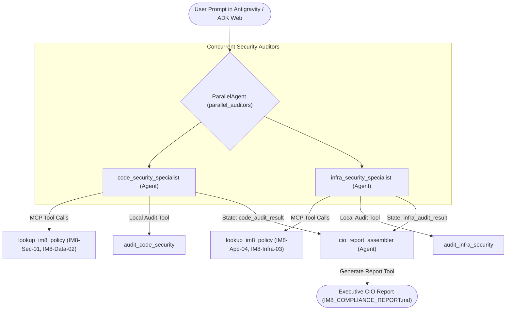

id: build-parallel-multiagent-im8-compliance-assistant
summary: Build an autonomous parallel multi-agent IM8 compliance and remediation companion with Antigravity, ADK, and MCP.
categories: AI, Cloud, Security, Government
environments: Web
status: Draft
authors: Google Singapore CE Team
tags: Antigravity, ADK, MCP, Gemini, IM8, GovTech

# Build an Autonomous IM8 Compliance & Remediation Companion with Antigravity, ADK & MCP

## 1. Overview & Objectives
Duration: 0:02:00

In this codelab, you step into the role of an **Agent Creator**. 

Rather than manually auditing software repositories, you instruct **Antigravity 2.0** to build an autonomous compliance companion. The system is built with the **Google Agent Development Kit (ADK)** and the **Model Context Protocol (MCP)**, powered by **Gemini 2.5 Flash**.

The agent system audits application source code and cloud infrastructure against Singapore Government **Instruction Manual 8 (IM8)** standards. It identifies security violations, executes automated code repairs, and generates an executive attestation report for the Agency Chief Information Officer (CIO).

### Multi-Agent Parallel Orchestration Architecture
This diagram illustrates how incoming audit requests run concurrently across specialized security agents before synthesizing into the CIO attestation report:



### 🚀 The Antigravity Way: Agentic Software Engineering
Traditionally, software tutorials require manual typing and copy-pasting code blocks. In this codelab, you pair-program with the **Antigravity Agent**. You write **prompts** to guide the agent in building, testing, and verifying the multi-agent system.

Each step includes:
1. 🤖 **The Agentic Prompt (Antigravity)**: The exact prompt to type into the Antigravity chat panel.
2. 📄 **Expected Reference Code**: The target structure you can review to verify what the agent generated.

### What You Will Learn
* How to pair-program with Antigravity 2.0 using natural language prompts.
* How to seed and query an SQLite policy catalog using a FastMCP server.
* How to build concurrent security auditors with Google ADK `ParallelAgent`.
* How to synthesize multi-agent findings using a sequential `cio_report_assembler`.
* How to interact with the multi-agent system using the visual ADK Web Interface (`adk web`).

---

## 2. Explore the Target Codebase and IM8 Rules
Duration: 0:03:00

Your workspace contains a mock Singapore public sector digital service located in `sample_target_repo/`.

### The 4 IM8 Compliance Rules to Enforce:

1. **IM8 Sec-01: No Hardcoded Secrets**
   - **Requirement**: Source files and configuration YAML must never store static credentials.
   - **Defect in repo**: `sample_target_repo/service/config.yaml` contains `apex_service_key: "apex-sec-prod-9841294812"`.

2. **IM8 Data-02: Citizen PII Data Protection**
   - **Requirement**: Citizen National Registration Identity Card (NRIC) numbers and telephone numbers must be masked in log files.
   - **Defect in repo**: `sample_target_repo/service/app.py` logs unmasked NRIC numbers and phone numbers in plain text.

3. **IM8 App-04: API Debug Route Hardening**
   - **Requirement**: Public services must disable or protect administrative debug endpoints.
   - **Defect in repo**: `sample_target_repo/service/app.py` exposes `/api/v1/debug/dump-records` without authentication.

4. **IM8 Infra-03: Cloud Storage Access Hardening**
   - **Requirement**: Government Commercial Cloud (GCC) buckets must prohibit public access.
   - **Defect in repo**: `sample_target_repo/infra/terraform/storage.tf` sets `public_access_prevention = "inherited"` and grants read permissions to `allUsers`.

---

## 3. Seed the IM8 Policy Database
Duration: 0:05:00

We represent official Singapore Government IM8 security policies inside a local SQLite database (`im8_policies.db`).

### 🤖 The Agentic Prompt (Antigravity)
Open the **Antigravity Chat Panel** and enter the following prompt:

```text
Create a python script named init_im8_db.py that initializes a local SQLite database named im8_policies.db. The database must contain two tables: im8_policies (storing rule_id, clause_title, domain, severity, requirement, remediation_guidance) and remediation_templates (storing rule_id, file_type, vulnerable_pattern, compliant_replacement, explanation). Seed it with policies for IM8-Sec-01, IM8-Data-02, IM8-App-04, and IM8-Infra-03 along with approved code remediation templates. Then, execute the script to initialize the database.
```

### 📄 Expected Reference Code
Here is what Antigravity generates inside `init_im8_db.py`:

```python
import sqlite3

def init_db():
    conn = sqlite3.connect("im8_policies.db")
    cursor = conn.cursor()
    cursor.execute("""
    CREATE TABLE IF NOT EXISTS im8_policies (
        rule_id TEXT PRIMARY KEY,
        clause_title TEXT,
        domain TEXT,
        severity TEXT,
        requirement TEXT,
        remediation_guidance TEXT
    )
    """)
    cursor.execute("""
    CREATE TABLE IF NOT EXISTS remediation_templates (
        id INTEGER PRIMARY KEY AUTOINCREMENT,
        rule_id TEXT,
        file_type TEXT,
        vulnerable_pattern TEXT,
        compliant_replacement TEXT,
        explanation TEXT,
        FOREIGN KEY(rule_id) REFERENCES im8_policies(rule_id)
    )
    """)
    # Seed IM8 rules and remediation templates...
    conn.commit()
    conn.close()

if __name__ == "__main__":
    init_db()
```

---

## 4. Build the FastMCP IM8 Policy Server
Duration: 0:08:00

Next, we expose the policy database via the **Model Context Protocol (MCP)** using `FastMCP`. The server connects to `im8_policies.db` and provides tools for looking up policy rules and remediation patterns.

### 🤖 The Agentic Prompt (Antigravity)
Enter the following prompt in the Antigravity chat panel:

```text
Create an MCP server script named mcp_im8_server.py using FastMCP. The server must connect to im8_policies.db and expose three tools: lookup_im8_policy(rule_id: str) -> str, list_active_im8_policies() -> str, and get_remediation_pattern(rule_id: str) -> str. Ensure each tool function includes rich docstrings and clear error handling. When executed directly, run the server over stdio transport.
```

### 📄 Expected Reference Code
Antigravity creates `mcp_im8_server.py`:

```python
import os
import sqlite3
import sys
from mcp.server.fastmcp import FastMCP

mcp = FastMCP("IM8PolicyServer")
DB_FILE = os.path.join(os.path.dirname(__file__), "im8_policies.db")

@mcp.tool()
def lookup_im8_policy(rule_id: str) -> str:
    """Look up Singapore Government IM8 policy requirements and severity by rule ID."""
    conn = sqlite3.connect(DB_FILE)
    cursor = conn.cursor()
    cursor.execute("SELECT rule_id, clause_title, domain, severity, requirement, remediation_guidance FROM im8_policies WHERE LOWER(rule_id) = LOWER(?)", (rule_id.strip(),))
    row = cursor.fetchone()
    conn.close()
    if row:
        return f"Rule ID: {row[0]}\nTitle: {row[1]}\nSeverity: {row[3]}\nRequirement: {row[4]}"
    return f"Rule '{rule_id}' not found."

@mcp.tool()
def list_active_im8_policies() -> str:
    """List all active Singapore Government IM8 security policies."""
    # Queries and returns all active rules
    ...

@mcp.tool()
def get_remediation_pattern(rule_id: str) -> str:
    """Retrieve the official government-approved code remediation template."""
    # Returns vulnerable pattern and replacement snippet
    ...

if __name__ == "__main__":
    mcp.run(transport="stdio")
```

---

## 5. Implement Audit and Remediation Tools
Duration: 0:08:00

We now build the native Python scanning and automated repair tools that inspect and modify `sample_target_repo/`.

### 🤖 The Agentic Prompt (Antigravity)
Enter the following prompt in the Antigravity chat panel:

```text
In app/tools.py, write three functions:
1. audit_code_security(target_repo: str = "sample_target_repo", remediate: bool = False) -> str: Checks service/config.yaml for hardcoded secrets (IM8 Sec-01) and service/app.py for unmasked citizen NRICs and phone numbers (IM8 Data-02). When remediate is True, it replaces the secret with ${APEX_SERVICE_KEY} and applies NRIC masking.
2. audit_infra_security(target_repo: str = "sample_target_repo", remediate: bool = False) -> str: Checks service/app.py for unauthenticated debug endpoints (IM8 App-04) and infra/terraform/storage.tf for public bucket bindings (IM8 Infra-03). When remediate is True, it removes the debug endpoint and enforces private bucket access.
3. generate_cio_report(report_content: str, output_path: str = "IM8_COMPLIANCE_REPORT.md") -> str: Writes the CIO attestation report to disk.
```

### 📄 Expected Reference Code
Antigravity creates `app/tools.py` with typed tools and regex repair patterns.

---

## 6. Build the Parallel Multi-Agent Pipeline
Duration: 0:10:00

We orchestrate the specialist agents into an ADK pipeline:
* `code_security_specialist`: Focuses on application code. Uses MCP policy tools and `audit_code_security`.
* `infra_security_specialist`: Focuses on cloud infrastructure. Uses MCP policy tools and `audit_infra_security`.
* `parallel_auditors`: Runs both specialist agents concurrently with `ParallelAgent`.
* `cio_report_assembler`: Gathers findings and writes `IM8_COMPLIANCE_REPORT.md`.

### 🤖 The Agentic Prompt (Antigravity)
Enter the following prompt in the Antigravity chat panel:

```text
In app/agent.py, construct a multi-agent ADK pipeline. Connect to mcp_im8_server.py using McpToolset with StdioConnectionParams. Create two specialist agents: code_security_specialist and infra_security_specialist, both equipped with the MCP policy tools and their respective audit tools. Group them under a ParallelAgent named parallel_auditors. Then create a sequential step with cio_report_assembler that uses generate_cio_report to write IM8_COMPLIANCE_REPORT.md. Bundle the pipeline into SequentialAgent and export app = App(root_agent=root_agent, name="app").
```

### 📄 Expected Reference Code
Antigravity constructs `app/agent.py`:

```python
from google.adk.agents import Agent, ParallelAgent, SequentialAgent
from google.adk.apps import App
from google.adk.tools.mcp_tool import McpToolset
from app.tools import audit_code_security, audit_infra_security, generate_cio_report

# Parallel Specialist Auditors
parallel_auditors = ParallelAgent(
    name="parallel_auditors",
    sub_agents=[code_security_agent, infra_security_agent]
)

# Executive Report Assembler
assembler_agent = Agent(
    name="cio_report_assembler",
    output_key="cio_report",
    tools=[generate_cio_report]
)

# Complete Sequential Pipeline
im8_pipeline = SequentialAgent(
    name="im8_pipeline",
    sub_agents=[parallel_auditors, assembler_agent]
)

root_agent = im8_pipeline
app = App(root_agent=root_agent, name="app")
```

---

## 7. Audit Target Repository in Scan Mode
Duration: 0:04:00

Now test the multi-agent pipeline in audit-only mode.

### 🤖 The Agentic Prompt (Antigravity)
In the Antigravity chat panel, prompt your agent:

```text
Run the im8_pipeline in audit mode against sample_target_repo. Do not remediate any files yet. Report all discovered compliance violations across code and infrastructure.
```

### Observed Findings
The parallel auditors discover all four non-compliant issues:
* **IM8 Sec-01**: Hardcoded APEX secret in `service/config.yaml`.
* **IM8 Data-02**: Unmasked citizen NRIC logged in `service/app.py`.
* **IM8 App-04**: Unauthenticated `/api/v1/debug/dump-records` endpoint in `service/app.py`.
* **IM8 Infra-03**: Public bucket configuration in `infra/terraform/storage.tf`.

---

## 8. Remediate Violations Autonomously
Duration: 0:04:00

Instruct Antigravity to trigger automated remediation across both security domains concurrently.

### 🤖 The Agentic Prompt (Antigravity)
In the Antigravity chat panel, prompt your agent:

```text
Run the im8_pipeline against sample_target_repo with remediation enabled. Repair all violations in code, configuration, and infrastructure files. Generate the final CIO attestation report.
```

### Verification
Once Antigravity completes the repair:
1. `service/config.yaml`: The hardcoded key is replaced by `${APEX_SERVICE_KEY}`.
2. `service/app.py`: Citizen NRIC and phone numbers are masked before logging.
3. `service/app.py`: The public debug endpoint is removed.
4. `infra/terraform/storage.tf`: Bucket access is set to `enforced` and `allUsers` is removed.

---

## 9. Launch the ADK Web Interface
Duration: 0:05:00

Google ADK includes a visual web interface to interact with your agents and inspect tool executions live.

### Launch Command
In your terminal, start the ADK web server:

```bash
adk web
```

Open your browser at:
```text
http://localhost:8000
```

### Web UI Workflow
1. Select the `app` agent in the navigation menu.
2. Type an audit query in the chat input:
   ```text
   Audit sample_target_repo and summarize our IM8 compliance posture for the Agency CIO.
   ```
3. Watch both `code_security_specialist` and `infra_security_specialist` execute concurrently in the tool call inspector.
4. View the final attestation output returned by `cio_report_assembler`.

---

## 10. Review the Executive CIO Attestation Report
Duration: 0:02:00

Open the generated report in your editor:
```text
IM8_COMPLIANCE_REPORT.md
```

### Sample Report Contents
* **Assessment Scope**: Target repository path and audit timestamp.
* **Overall Posture**: `COMPLIANT (REMEDIATED)`.
* **Deployment Recommendation**: `APPROVED for Government Commercial Cloud (GCC) deployment.`
* **Itemized Control Matrix**: Itemized record of all 4 IM8 rules and remediation actions.

---

## 11. Summary & Next Steps
Duration: 0:02:00

Congratulations! You have completed the **Autonomous IM8 Compliance Agent** codelab.

### What You Achieved
1. You seeded a centralized IM8 policy catalog in SQLite.
2. You exposed government compliance policies through a FastMCP server.
3. You orchestrated concurrent specialist auditors using Google ADK `ParallelAgent`.
4. You interacted with the multi-agent system entirely through natural language prompts in Antigravity 2.0.
5. You inspected live agent steps using the ADK Web Interface.
