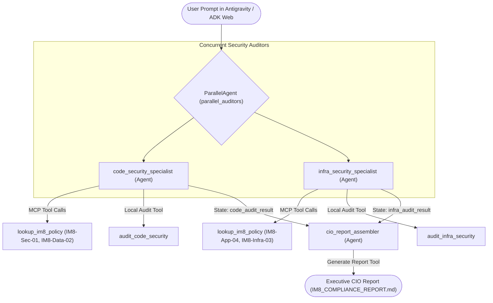

# Play 4: Autonomous IM8 Compliance Checking & Remediation Agent

Welcome to the **Autonomous IM8 Compliance Companion** repository. This project provides a multi-agent system built with the **Google Agent Development Kit (ADK)** and the **Model Context Protocol (MCP)**. The system audits software repositories against Singapore Government Instruction Manual 8 (IM8) policies, automatically repairs code and infrastructure defects, and generates an executive Chief Information Officer (CIO) attestation report.

---

## System Diagrams

### 1. Developer Tooling and Lifecycle Workflow
This diagram illustrates how developer tooling and agent components connect in Antigravity 2.0:


---

### 2. Multi-Agent Parallel Orchestration Architecture
This diagram illustrates how the multi-agent pipeline processes audits concurrently:



---

## Repository Structure

```text
agy-im8-agent/
├── app/                          # Core multi-agent package
│   ├── __init__.py               # Package exports
│   ├── agent.py                  # Parallel and sequential agent pipeline definition
│   └── tools.py                  # Code audit, remediation, and reporting tools
├── im8_policies.db               # SQLite database containing official IM8 security policies
├── init_im8_db.py                # Database seed script for IM8 policies
├── mcp_im8_server.py             # FastMCP stdio server exposing policy lookup tools
├── sample_target_repo/           # Target repository with sample IM8 violations
│   ├── service/                  # Application code (FastAPI, YAML config)
│   └── infra/terraform/          # Infrastructure definitions (Terraform storage)
├── CODELAB.md                    # Step-by-step Antigravity 2.0 interactive codelab guide
├── README.md                     # Project overview and architecture documentation
└── pyproject.toml                # Project dependencies and packaging definition
```

---

## Quick Start

### 1. Initialize the Policy Database
Run the seed script to populate the IM8 policy database:
```bash
python3 init_im8_db.py
```

### 2. Launch the ADK Web Interface
Start the local Google ADK visual interface:
```bash
adk web
```
Open `http://localhost:8000` in your browser to interact with the multi-agent system.

### 3. Run Audit via Antigravity 2.0
In Antigravity 2.0, open the chat panel and submit audit and remediation prompts as guided in [CODELAB.md](CODELAB.md).
