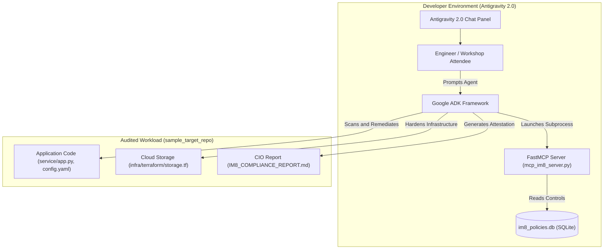
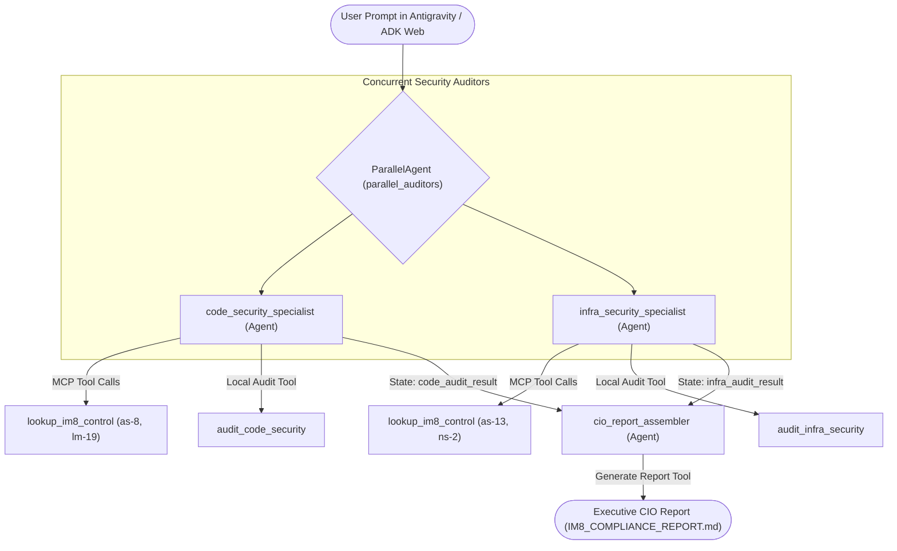

# Play 4: Autonomous IM8 Compliance Checking & Remediation Agent

Welcome to the **Autonomous IM8 Compliance Companion** repository. This project provides a multi-agent system built with the **Google Agent Development Kit (ADK)** and the **Model Context Protocol (MCP)**. The system audits a software repository against four controls from the public Singapore Government ICT&SS Policy (IM8 Reform) catalog, repairs the defects it finds, and writes an executive Chief Information Officer (CIO) attestation report.

## Controls in scope

| Control | Title | Group | Low-risk cloud profile |
|---|---|---|---|
| `as-8` | Secrets Management | Application Security | Level 1, should-have |
| `lm-19` | Log Sanitisation | Logging and Monitoring | Level 2, good-to-have |
| `as-13` | Exposure of Internal System Details | Application Security | Level 2, good-to-have |
| `ns-2` | Access Restrictions on CSP Resources Outside Virtual Network | Network Security | Level 1, should-have |

> [!IMPORTANT]
> The full Instruction Manual 8 is not a public document. Only the IM8 Reform
> control catalog for low-risk cloud systems is published. This lab uses four
> controls from that public catalog and nothing else.

### Attribution

The control identifiers, statements and guidance come from the Singapore
Government ICT&SS Policy (IM8 Reform) control catalog.

* Repository: <https://github.com/GovTechSG/tech-standards>
* File: `catalogs/im8-reform.json`, version 2025.05.13
* Licence: MIT, Government Technology Agency of Singapore

The repair templates in `init_im8_db.py` are teaching examples written for this
lab. They are not part of the published catalog.

---

## System Diagrams

### 1. Developer Tooling and Lifecycle Workflow
This diagram illustrates how developer tooling and agent components connect in Antigravity 2.0:



---

### 2. Multi-Agent Parallel Orchestration Architecture
This diagram illustrates how the multi-agent pipeline processes audits concurrently:



---

## Repository Structure

```text
agy-im8-agent/
├── app/                          # Core multi-agent package
│   ├── __init__.py               # Package exports
│   ├── agent.py                  # Parallel and sequential agent pipeline definition
│   └── tools.py                  # Code audit, remediation, and reporting tools
├── im8_policies.db               # SQLite copy of the four IM8 Reform controls
├── init_im8_db.py                # Seed script. Holds the control text and the attribution
├── mcp_im8_server.py             # FastMCP stdio server exposing the control lookup tools
├── sample_target_repo/           # Target repository with sample IM8 violations
│   ├── service/                  # Application code (FastAPI, YAML config)
│   └── infra/terraform/          # Infrastructure definitions (Terraform storage)
├── CODELAB.md                    # Step-by-step Antigravity 2.0 interactive codelab guide
├── README.md                     # Project overview and architecture documentation
└── pyproject.toml                # Project dependencies and packaging definition
```

---

## Quick Start

### 1. Initialize the Control Database
Run the seed script to populate the local control catalog:
```bash
python3 init_im8_db.py
```

### 2. Launch the ADK Web Interface
Start the local Google ADK visual interface:
```bash
adk web
```
Open `http://localhost:8000` in your browser to interact with the multi-agent system.

### 3. Run Audit via Antigravity 2.0
In Antigravity 2.0, open the chat panel and submit audit and remediation prompts as guided in [CODELAB.md](CODELAB.md).
