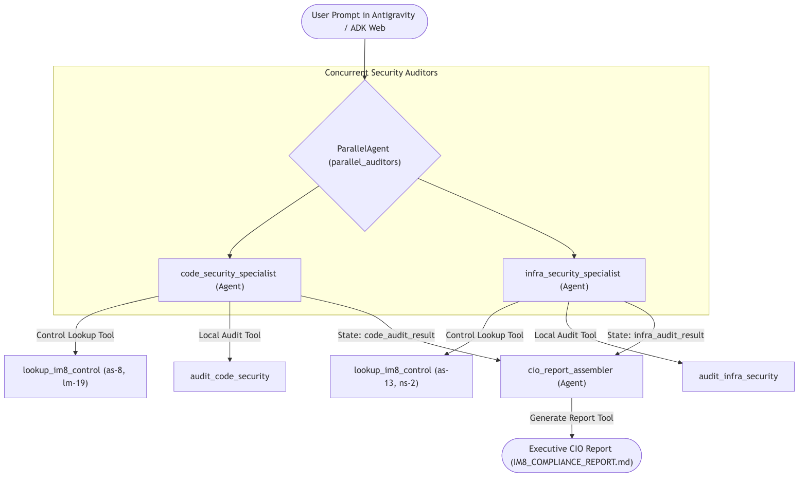
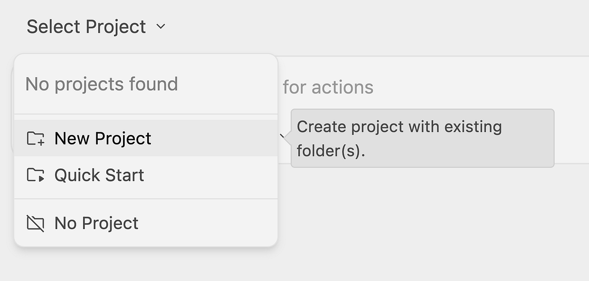
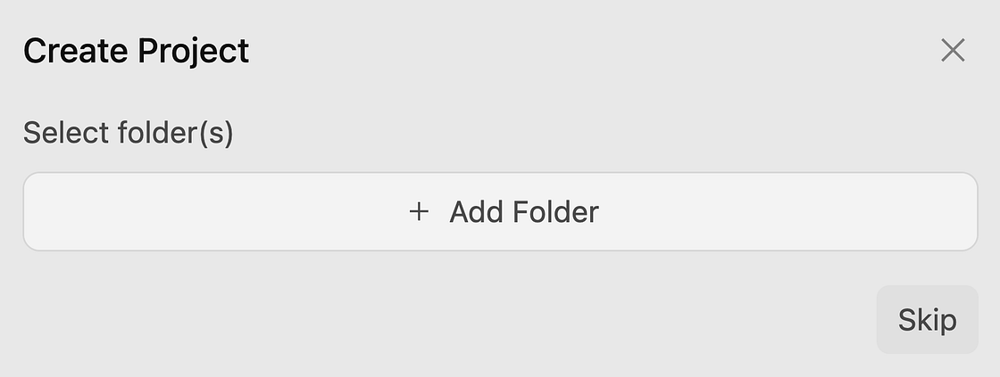

id: adk-im8-compliance-agent
summary: Build an IM8 compliance agent with Antigravity 2.0, Agents CLI, and ADK, deploy it to Agent Runtime, and register it with Gemini Enterprise.
categories: AI, Cloud
environments: Web
status: Draft
feedback link: https://github.com/tohweizhong/agentic-demos/issues
authors: Weizhong Toh, Hezron Jebakumar, Tad Einstein
tags: antigravity, adk, agents-cli, gemini-enterprise, im8, govtech, security, government

# Build and Deploy an IM8 Compliance Agent with Antigravity 2.0, Agents CLI, ADK, Agent Runtime, and Gemini Enterprise

## Overview

In this lab, you act as an **Agent Creator** for a Singapore public sector agency preparing to deploy a citizen microservice on the **Government Commercial Cloud (GCC)**.

Instead of writing audit scripts manually, you use **Google Antigravity 2.0**, **Google Agents CLI** (`agents-cli`), and the **Google Agent Development Kit (ADK)** to assemble an autonomous **Instruction Manual 8 (IM8) Compliance and Remediation Companion**. You then deploy the multi-agent pipeline to **Gemini Enterprise Agent Runtime** and register it with a pre-staged **Gemini Enterprise** application (**Explore AI**).

Under the IM8 Reform programme, the Government Technology Agency of Singapore (GovTech) publishes machine-readable security controls in the [GovTech Singapore Tech Standards repository](https://github.com/GovTechSG/tech-standards). Your workspace (`~/Desktop/im8-compliance-agent`) comes pre-staged with:

* A sample public sector application (`sample_target_repo/`) containing four planted IM8 compliance defects. The source is on GitHub: [agentic-demos/codelabs/adk-im8-compliance-agent/sample_target_repo](https://github.com/tohweizhong/agentic-demos/tree/main/codelabs/adk-im8-compliance-agent/sample_target_repo).
* A local IM8 Reform policy database (`im8_policies.db`).
* Pre-built deterministic policy lookup, code/infrastructure audit, and remediation tools (`tools.py`).

| Control ID | Control Title | IM8 Profile | Planted Defect in `sample_target_repo/` | Automated Remediation Action |
| :---- | :---- | :---- | :---- | :---- |
| `as-8` | Secrets Management | Level 1 | `service/config.yaml` stores the static production secret `apex-sec-prod-9841294812`. | Replaces the static key with the environment reference `${APEX_SERVICE_KEY}`. |
| `lm-19` | Log Sanitisation | Level 2 | `service/app.py` logs citizen NRIC and telephone numbers in plaintext. | Masks citizen NRIC and telephone numbers prior to logging. |
| `as-13` | Exposure of Internal System Details | Level 2 | `service/app.py` exposes the unauthenticated `/api/v1/debug/dump-records` route. | Removes the unauthenticated debug endpoint from the service. |
| `ns-2` | Access Restrictions on CSP Resources Outside Virtual Network | Level 1 | `infra/terraform/storage.tf` sets `public_access_prevention` to `inherited` and grants read access to `allUsers`. | Enforces `public_access_prevention = "enforced"` and removes the `allUsers` IAM binding. |

### Multi-agent parallel orchestration architecture

You prompt **Antigravity 2.0** to assemble `app/agent.py` using an ADK `ParallelAgent` (`parallel_auditors`) and `SequentialAgent` (`im8_pipeline`) connected to the pre-staged `app/tools.py` functions:

* `code_security_specialist`: Calls `lookup_im8_control` and `audit_code_security` to evaluate and repair `as-8` and `lm-19`.
* `infra_security_specialist`: Calls `lookup_im8_control` and `audit_infra_security` to evaluate and repair `as-13` and `ns-2`.
* `cio_report_assembler`: Combines the parallel audit findings, retrieves the Singapore Standard Time (SGT) timestamp via `get_assessment_timestamp`, and writes `IM8_COMPLIANCE_REPORT.md` via `generate_cio_report`.



### What you'll learn

In this lab, you learn how to perform the following tasks:

* Scaffold an ADK agent project in Google Antigravity 2.0 using Google Agents CLI (`agents-cli`).
* Assemble the multi-agent IM8 compliance pipeline (`app/agent.py`) using pre-staged policy and audit tools (`app/tools.py`).
* Test the IM8 compliance scan and automated remediation in the ADK web playground.
* Deploy the agent to Gemini Enterprise Agent Runtime and register it with the pre-staged **Explore AI** Gemini Enterprise application.

### Prerequisites

To get the most out of this lab, you should have:

* Basic familiarity with Google Cloud and AI agent workflows.

## Task 1. Access Antigravity 2.0 and scaffold the agent

In this task, you open **Antigravity 2.0**, load the pre-staged `~/Desktop/im8-compliance-agent` workspace, and scaffold the ADK project structure using **Google Agents CLI** (`agents-cli`).

### Open Antigravity 2.0

1. Open the **Google Antigravity 2.0** desktop application.
2. Set the agent to **Always proceed** mode.

### Open the IM8 workspace project in Antigravity 2.0

1. In Antigravity 2.0, click the **Create New Project** icon next to **Projects**, or press CTRL+K (or CMD+K on macOS) and select **New Project**.



2. Click **Add Folder**, select the **im8-compliance-agent** folder under `Desktop` (`~/Desktop/im8-compliance-agent`), and click **Open**.



3. Click **Next**, leave the remaining settings as their defaults, and click **Create Project**.

### Scaffold the ADK project using Google Agents CLI

1. In the Antigravity 2.0 chat input box, paste the following prompt and press ENTER (if prompted to select a boot mode, select **Local Mode**):

```text
Use agents-cli scaffold create to scaffold an ADK agent project targeting Agent Runtime (-a adk -d agent_engine --yes) into /tmp/im8-scaffold, and copy the scaffolded app/, tests/, pyproject.toml, and GEMINI.md into the current workspace while preserving existing files. Then copy the pre-staged tools.py, im8_policies.db, and sample_target_repo/ into app/ so they are bundled with the agent, and summarize the pre-staged functions in app/tools.py.
```

2. Verify in the Antigravity 2.0 chat response that the project scaffolding is created and `app/tools.py`, `app/im8_policies.db`, and `app/sample_target_repo/` are in place.

## Task 2. Assemble the IM8 compliance agent using Antigravity 2.0

In this task, you prompt **Antigravity 2.0** to assemble the multi-agent pipeline in `app/agent.py` using the pre-staged tools in `app/tools.py`.

1. In the Antigravity 2.0 chat input box, paste the following prompt and press ENTER:

```text
Read requirements.md and app/tools.py. Implement app/agent.py using Gemini(model="gemini-3.8-flash", retry_options=types.HttpRetryOptions(attempts=3)) as the shared model configuration by assembling:

1. code_security_specialist (using lookup_im8_control and audit_code_security for controls as-8 and lm-19, with output_key="code_audit_result").

2. infra_security_specialist (using lookup_im8_control and audit_infra_security for controls as-13 and ns-2, with output_key="infra_audit_result").

3. parallel_auditors as a ParallelAgent running code_security_specialist and infra_security_specialist concurrently.

4. cio_report_assembler (using get_assessment_timestamp and generate_cio_report, with output_key="cio_report") and im8_pipeline as a SequentialAgent combining parallel_auditors and cio_report_assembler.

Export root_agent = im8_pipeline and app = App(root_agent=root_agent, name="app"), and verify that app.agent imports cleanly.
```

2. Wait for Antigravity 2.0 to create `app/agent.py` and confirm that `root_agent` imports cleanly.

## Task 3. Test the agent in the ADK web playground

In this task, you start the local ADK web playground and test both compliance scanning and automated remediation.

### Launch the ADK web playground

1. In the Antigravity 2.0 chat input box, paste the following prompt and press ENTER:

```text
Start ./run_adk_web.sh in the background so the ADK web playground is running on http://localhost:8000, and confirm port 8000 is listening.
```

2. In your web browser, navigate to `http://localhost:8000`, and press ENTER.
3. In the ADK web playground agent selector dropdown, select **app**.

### Run a compliance scan and automated remediation

1. In the ADK web chat input box, enter the following prompt and press ENTER to run a read-only compliance scan:

```text
Audit sample_target_repo for IM8 compliance. Do not remediate anything. Report every violation you find across code and infrastructure.
```

2. Verify in the assistant response that `parallel_auditors` runs `code_security_specialist` and `infra_security_specialist` concurrently and reports all four IM8 controls (`as-8`, `lm-19`, `as-13`, and `ns-2`) as **NON-COMPLIANT**.
3. In the same ADK web chat input box, enter the following prompt and press ENTER to execute automated remediation and generate the CIO attestation report:

```text
Remediate every violation in sample_target_repo now. Repair the code, configuration, and infrastructure files, and write the Executive CIO Attestation Report.
```

4. Verify that the response outputs the Executive CIO Attestation Report (`IM8_COMPLIANCE_REPORT.md`) with all four controls marked **REMEDIATED (COMPLIANT)** and an overall recommendation of **APPROVED for Government Commercial Cloud (GCC) Deployment**.

## Task 4. Deploy the agent to Gemini Enterprise Agent Runtime

In this task, you instruct **Antigravity 2.0** to deploy your assembled IM8 compliance agent to **Gemini Enterprise Agent Runtime** using **Google Agents CLI**.

1. Switch back to the **Antigravity 2.0** application window, paste the following prompt into the chat input box, and press ENTER:

```text
Reset sample_target_repo/ to its initial state (git checkout -- sample_target_repo/ && cp -r sample_target_repo app/), then use agents-cli deploy --no-confirm-project to deploy the IM8 compliance agent to Gemini Enterprise Agent Runtime, and display the deployed Agent Runtime console URL when complete.
```

2. Wait 5 to 10 minutes for Antigravity 2.0 to complete the deployment and output the **Agent Runtime** URL.
3. Copy the returned Google Cloud console URL and open it in a **new browser tab** where you are signed in to the Google Cloud console to view your deployed agent in **Agent Runtime**.
4. Select **Playground** in the Agent Runtime console and enter the following prompt to verify the deployed cloud agent:

```text
Audit sample_target_repo for IM8 compliance. Do not remediate anything. Report every violation you find across code and infrastructure.
```

## Task 5. Register the agent with Gemini Enterprise

In this task, you instruct **Antigravity 2.0** to register your deployed IM8 compliance agent with the pre-staged **Explore AI** Gemini Enterprise application and run the compliance scan and remediation workflow in Gemini Enterprise.

A Gemini Enterprise application named **Explore AI** has been pre-created and staged for you in the environment so Antigravity 2.0 can register your agent directly.

1. Switch back to the **Antigravity 2.0** chat input box, paste the following prompt, and press ENTER:

```text
Use agents-cli publish gemini-enterprise to register the deployed IM8 compliance agent with the pre-staged "Explore AI" (explore-ai) Gemini Enterprise application, and display the Gemini Enterprise web application URL.
```

2. Wait for Antigravity 2.0 to complete the registration and return the **Explore AI** Gemini Enterprise URL.
3. Copy the returned URL and open it in a **new browser tab** to launch the **Explore AI** Gemini Enterprise web application.
4. Click the **Agents** tab in the left navigation pane and select your registered IM8 compliance agent.
5. In the Gemini Enterprise chat input box, enter the following prompt and press ENTER to run a read-only IM8 compliance scan:

```text
Audit sample_target_repo for IM8 compliance. Do not remediate anything. Report every violation you find across code and infrastructure.
```

6. Verify that the agent evaluates all four IM8 controls (`as-8`, `lm-19`, `as-13`, and `ns-2`) and reports them as **NON-COMPLIANT**.
7. In the same Gemini Enterprise chat input box, enter the following prompt and press ENTER to remediate the violations and generate the Executive CIO Attestation Report:

```text
Remediate every violation in sample_target_repo now. Repair the code, configuration, and infrastructure files, and write the Executive CIO Attestation Report.
```

8. Verify that the agent repairs all four IM8 violations and outputs the completed Executive CIO Attestation Report with an overall recommendation of **APPROVED for Government Commercial Cloud (GCC) Deployment**.

## Congratulations!

You have scaffolded, assembled, tested, and deployed an autonomous multi-agent IM8 Compliance and Remediation Companion using Google Antigravity 2.0, Google Agents CLI, and Google ADK, and registered it with Gemini Enterprise!
