id: build-nus-transit-hub-antigravity
summary: Build a live NUS Campus Transit Hub & Telegram Bot with Spec-Driven Development in Google Antigravity.
categories: AI Agents, Web, Next.js, Telegram, TypeScript
environments: Web
status: Published
feedback link: https://github.com/nusmodifications/nusmods
authors: Jarrett Yeo, Weizhong Toh
keywords: docType:Codelab,category:AiAndMachineLearning,category:Web,product:Antigravity,product:GoogleCloud,product:Gemini,language:TypeScript,framework:Nextjs
layout: scrolling

# Introduction to Google’s Antigravity – Build your own NUS shuttle bus timing web app and Telegram bot

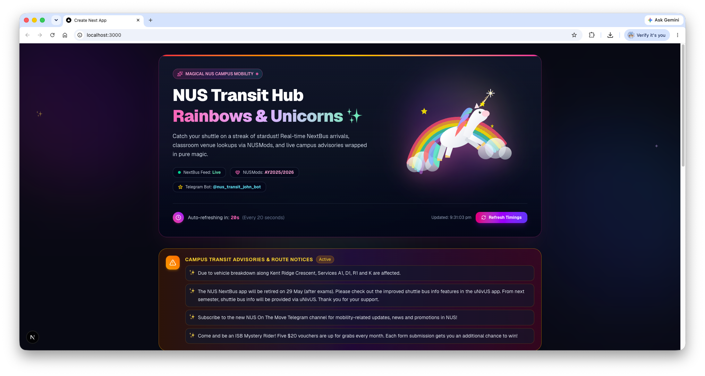
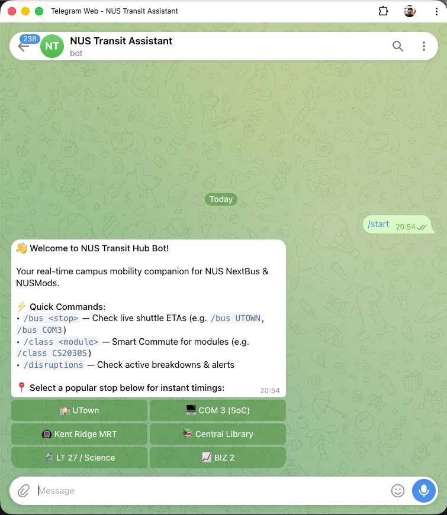

## Overview & Objectives
Duration: 0:03:00

In this codelab, you will build the **NUS Campus Transit & Smart Commute Hub** — a unified system consisting of:
1. **An Interactive Web Dashboard**: Displays live NUS shuttle bus arrival countdowns, vehicle capacity, active service disruption banners, and a "Smart Commute" timetable finder that maps university course lecture venues (e.g., `COM3-01-23` or `LT27`) to the nearest campus bus stop.
2. **A Real-Time Telegram Transit Bot**: Provides on-the-go bus arrival lookups (`/bus UTOWN`), live campus transit incident broadcasts (`/disruptions`), and course venue transit directions (`/class CS2030S`).
3. **(Optional Challenge) Serverless Deployment to Vercel**: Deploys both the Web App and the Telegram Bot as a unified serverless webhook service on Vercel with zero server maintenance.

### System Architecture & Data Flow
This diagram illustrates how your application integrates live university data sources and orchestrates the user interfaces:

```
                      ┌───────────────────────────────────────────────┐
                      │             Live External APIs                │
                      │  ┌───────────────────┐ ┌───────────────────┐  │
                      │  │  NUS NextBus API  │ │  NUSMods API v2   │  │
                      │  │ (Shuttle & Alerts)│ │ (Timetable & Venue│  │
                      │  └─────────┬─────────┘ └─────────┬─────────┘  │
                      └────────────┼─────────────────────┼────────────┘
                                   │                     │
                                   ▼                     ▼
                      ┌───────────────────────────────────────────────┐
                      │              Shared Data Layer                │
                      │   • lib/nextbus.ts      • lib/nusmods.ts      │
                      └────────────┬─────────────────────┬────────────┘
                                   │                     │
                     ┌─────────────┴────────┐   ┌────────┴────────────┐
                     │                      │   │                     │
                     ▼                      ▼   ▼                     ▼
     ┌───────────────────────────────┐ ┌──────────────────────────────┐
     │      Telegram Transit Bot     │ │   Flashy Web Transit Hub     │
     │  • lib/bot.ts (grammY)        │ │  • app/page.tsx (Tailwind UI)│
     │  • Dev: Local Polling         │ │  • Live Bus Arrival Grid     │
     │  • Prod: /api/telegram webhook│ │  • Disruption Alert Ticker   │
     └───────────────────────────────┘ │  • Smart Venue Search Bar    │
                                       └──────────────────────────────┘
```

### 🚀 The Antigravity Way: Spec-Driven Development (SDD)
In traditional coding workshops, you spend 90% of your time manually copy-pasting code blocks and debugging typo errors. 

In this workshop, you will pair-program with the **Antigravity AI Agent** using **Spec-Driven Development (SDD)**:
1. **Rule Anchoring (`.agents/rules/`)**: Set explicit project standards, API contracts, venue mappings, and UX constraints so the agent adheres strictly to architectural best practices.
2. **Implementation Planning (`/plan`)**: Use Antigravity's planning engine to generate a detailed `implementation_plan.md` blueprint before executing code.
3. **Agentic Code Synthesis**: Guide the agent with clear natural language prompts to write, refactor, and verify production code.

Each section includes:
* **🤖 The Agentic Prompt**: The exact prompt to give the Antigravity chat panel.
* **📄 Expected Reference Code**: The target code structure you can use to review and verify what your agent generates.
* **🧪 Terminal Verification**: Commands to run and verify functionality immediately.

### What You Will Learn
* How to use the Antigravity VS Code extension surface to pair-program with an autonomous developer agent.
* How to establish workspace rules (`.agents/rules/workspace.md`) to prevent hallucinations and lock down architectural decisions.
* How to use Antigravity's Planning Mode (`/plan`) to review implementation blueprints before generating code.
* How to integrate the **NUS NextBus API** (real-time shuttle ETAs, active vehicles, announcements) and **NUSMods API v2** (academic modules, timetable schedules, classroom venue codes).
* How to build a Telegram bot using `grammY` with both local polling and Vercel serverless webhook execution.
* How to build an interactive, responsive transit dashboard using Next.js 14 and Tailwind CSS.

---

## Environment Setup, Rules & Scaffolding
Duration: 0:07:00

In this section, we will scaffold a modern Next.js TypeScript project, configure project dependencies, acquire a free Telegram Bot token, and establish Antigravity Rules.

### 1. Prerequisites Check
Ensure you have the following installed on your machine:
* **Node.js** (version 18.17.0 or higher) - Download Node.js [here](https://nodejs.org/en/download).
* **VS Code** with the **Antigravity Extension** installed and logged in - Download VS Code [here](https://code.visualstudio.com/download?_exp_download=fb315fc982) and Antigravity Extension [here](https://marketplace.visualstudio.com/items?itemName=lyadhgod.antigravity-vscode)
* **Telegram Account** (Mobile or Desktop App) - Download [here](https://telegram.org/)
* **Vercel Account** (Free Hobby plan for Phase 6 optional cloud deployment) - Sign up [here](https://vercel.com/signup)

### 2. Obtain a Telegram Bot Token
1. Open Telegram and search for `@BotFather`.
2. Send `/start`, then send `/newbot`.
3. Choose a friendly name (e.g., `NUS Transit Assistant`) and a unique username ending in `bot` (e.g., `nus_transit_john_bot`).
4. BotFather will provide an HTTP API token (e.g., `7123456789:AAFn8...`). Save this token!

### 3. Open VS Code & Scaffold the Next.js Project
1. Open **Visual Studio Code**.
2. Create a new folder named `google-workshop` in your desired location (such as `Documents` or `Downloads`), and open it in VS Code (`File > Open Folder...`).
3. Open the integrated terminal in VS Code (`Terminal > New Terminal` or press `` Ctrl+` `` / `` Cmd+` ``).

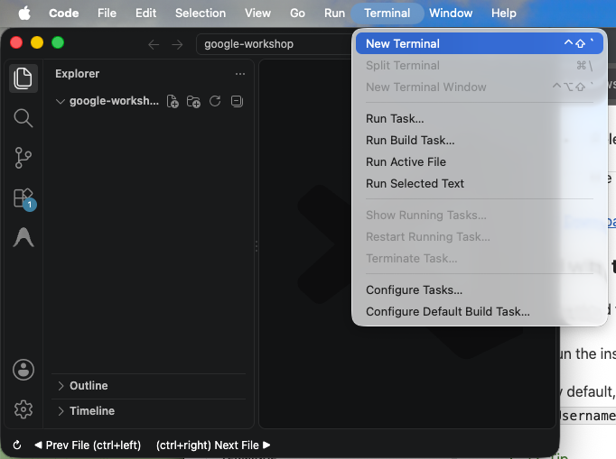

4. Run the following commands in the integrated terminal:

```bash
# 1. Create a Next.js project named nus-transit-hub (single line works across Windows & Mac)
npx create-next-app@latest nus-transit-hub --typescript --tailwind --eslint --app --src-dir=false --import-alias="@/*" --use-npm --yes

# 2. Step into the created project directory
cd nus-transit-hub

# 3. Install runtime dependencies: grammY (Telegram bot), Lucide React (icons), and tsx (dev runner)
npm install grammy lucide-react dotenv
npm install -D tsx @types/node
```

> **Understanding the Dependencies**:
> * **`grammY`**: A TypeScript framework for the Telegram Bot API. Instead of manually writing boilerplate HTTP requests to Telegram's raw endpoints (`https://api.telegram.org`), `grammY` provides type-safe methods to handle user commands (`/start`, `/bus`), format Markdown responses, and build interactive buttons. It runs seamlessly on local Node.js and in serverless environments like Vercel.
> * **`lucide-react`**: A clean, modern icon library used in our Web Dashboard.
> * **`dotenv`**: Loads secret tokens and API credentials from `.env.local` into Node.js.
> * **`tsx`**: A TypeScript runtime execution tool that lets us run TypeScript files directly in development without needing manual compilation.

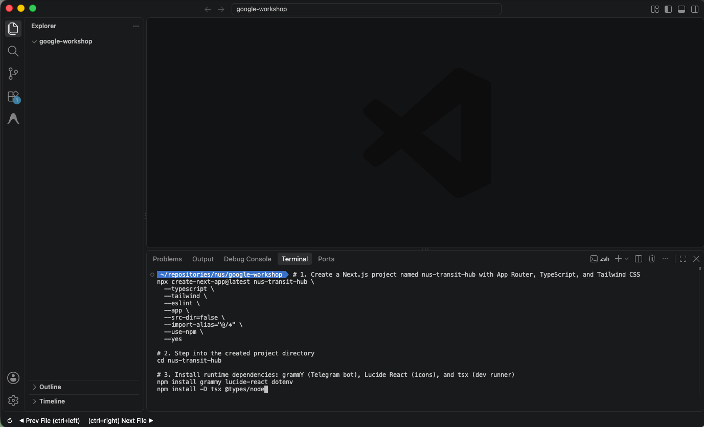

### 4. Create Environment Configuration (`.env.local`)
1. In the VS Code file explorer sidebar, expand the `nus-transit-hub` folder.

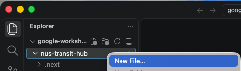

2. Right click on the `nus-transit-hub` folder, and click on "New file". Name the new file `.env.local`.

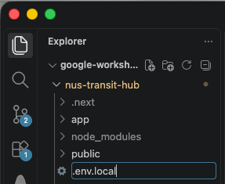

3. Double click on `.env.local` to open the file, then paste the following configuration into `.env.local` and replace `YOUR_TELEGRAM_BOT_TOKEN_HERE` with your actual token from `@BotFather`:

```env
# Telegram Bot Token from @BotFather
TELEGRAM_BOT_TOKEN="YOUR_TELEGRAM_BOT_TOKEN_HERE"

# NUS NextBus API Basic Auth Credentials (Publicly Documented)
NEXTBUS_USERNAME="NUSnextbus"
NEXTBUS_PASSWORD='13dL?zY,3feWR^"T'
```

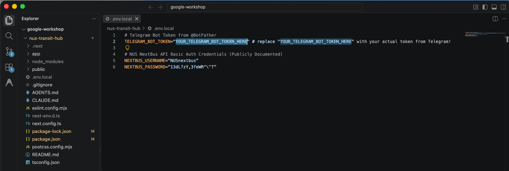

<aside class="important">
<b>Replace the Token</b>: Make sure to replace <code>YOUR_TELEGRAM_BOT_TOKEN_HERE</code> with the actual bot token received from BotFather.
</aside>

4. Finally, save the file using `CTRL`+`S` (Windows) or `CMD`+`S` (Mac), or go to `File > Save`.

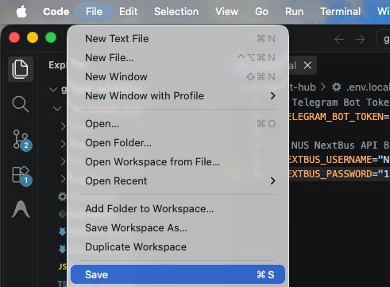

### 5. Establish Antigravity Rules (`.agents/rules/workspace.md`)
Antigravity uses workspace rules inside `.agents/rules/` to guide code generation, style conventions, and dependency constraints across all conversations. Setting these specifications in stone upfront prevents the agent from making arbitrary guesses and ensures 100% consistent builds.

1. Open a new terminal in VS Code by going to Terminal > New terminal.

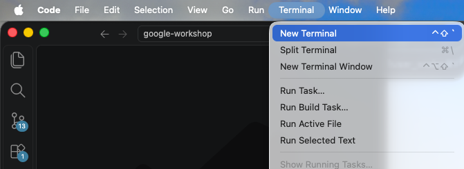

2. In your VS Code integrated terminal, create the `.agents/rules` directory:

```bash
mkdir -p .agents/rules
```

3. In the VS Code file explorer sidebar, expand the `.agents` folder, right-click on the `rules` folder, and click on "New File". Name the new file `workspace.md`.

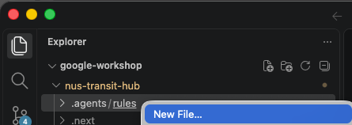

4. Double-click on `workspace.md` to open the file, then paste the following configuration into `workspace.md`:

```markdown
# NUS Transit Hub Project Rules

## Tech Stack & Conventions
- Framework: Next.js 14 App Router with TypeScript and Tailwind CSS.
- Telegram Bot: Use `grammY` library. Support hybrid mode: local polling script (`scripts/bot-dev.ts`) and Vercel serverless webhook (`app/api/telegram/route.ts`).
- NPM Scripts: Preserve all default Next.js scripts (`"dev": "next dev"`, `build`, `start`, `lint`) and add `"bot:dev": "tsx scripts/bot-dev.ts"` to `package.json`.
- API Integrations:
  - NUS NextBus API: Base URL `https://nnextbus.nus.edu.sg/` with HTTP Basic Authentication (`NEXTBUS_USERNAME` / `NEXTBUS_PASSWORD`).
  - NUSMods API: Base URL `https://api.nusmods.com/v2/2025-2026/` (No auth required).

## Venue to Bus Stop Mapping Dictionary
Map classroom venue codes to nearest bus stops:
- `COM1`, `COM2`, `COM3` -> `COM 3` (`COM3`)
- `LT27`, `S17`, `SCIENCE` -> `LT 27 / Science` (`LT27`)
- `UT`, `UTOWN`, `ERC` -> `University Town` (`UTOWN`)
- `CLB`, `LIBRARY`, `AS` -> `Central Library / FASS` (`CLB`)
- `BIZ1`, `BIZ2`, `HSSML` -> `BIZ 2` (`BIZ2`)
- `EA`, `E1`, `E2`, `ENG` -> `Engineering` (`EA`)
- `KR-MRT`, `NUH` -> `Kent Ridge MRT` (`KR-MRT`)
- Fallback: `University Town` (`UTOWN`)

## Telegram Bot Feature Specifications
- `/start`: Welcome message with inline quick-action buttons for popular stops (`UTOWN`, `COM3`, `KR-MRT`, `CLB`).
- `/bus <stop>`: Formatted ETA list with visual urgency badges (🟢 <=3 min, 🟡 4-8 min, 🔴 >8 min / out of service).
- `/disruptions`: List of active vehicle breakdowns and transit advisories with HTML stripped.
- `/class <moduleCode>`: Queries NUSMods timetable, extracts 1st lesson day/time/venue, resolves nearest bus stop, and appends live shuttle arrivals.
- Inline Keyboard: Clicking a quick stop button returns live bus timings instantly.

## Web Dashboard Specifications
- Header with live badge and auto-refresh countdown timer (20s interval).
- Top Disruption Alert Banner displaying active announcements.
- Stop Selector Buttons for popular stops (UTown, COM 3, Kent Ridge MRT, Central Library, LT 27, BIZ 2).
- Responsive Shuttle Arrival Grid with countdown badges and bus plate numbers.
- Smart Commute Search Bar: Input module code (e.g. `CS2030S`) to display lesson schedule, venue, mapped bus stop, and nearby shuttle arrivals.

## Error Handling & Robustness
- Gracefully handle off-service hours (e.g. late night) with friendly messages.
- Filter out HTML tags from announcements.
- Strict TypeScript interfaces for all payloads. Avoid `any`.
```

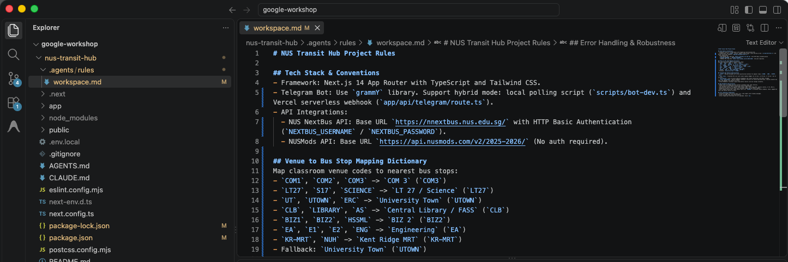

5. Finally, save the file using `CTRL`+`S` (Windows) or `CMD`+`S` (Mac), or go to `File > Save`.

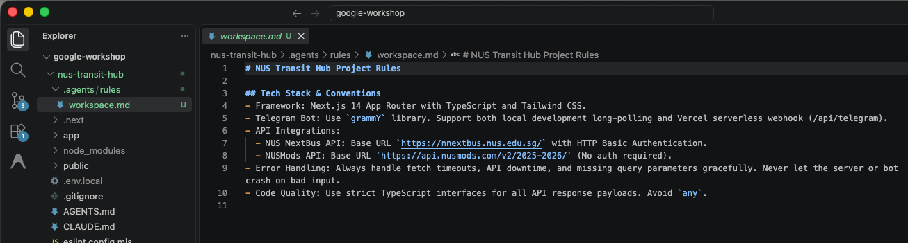

---

## Phase 1: Architecture Blueprint & Planning Mode with `/plan`
Duration: 0:10:00

Before generating code, professional developers review an implementation plan to verify architecture, module boundaries, and interfaces.

In Antigravity, **Planning Mode** (`/plan`) reads your project context and `.agents/rules/workspace.md` to generate a structured `implementation_plan.md` artifact detailing every file, API wrapper, component, and verification test.

### 🤖 The Agentic Prompt (Antigravity)
Open the **Antigravity Chat Panel** and enter the following prompt:

```text
/plan Generate a comprehensive implementation plan to build the NUS Campus Transit Hub & Telegram Bot according to our .agents/rules/workspace.md.
Detail the file creations and verification steps for:
1. `lib/types.ts`: TypeScript interfaces for NextBus and NUSMods.
2. `lib/nextbus.ts`: API wrapper with Basic Auth for BusStops, ShuttleService, and Announcements.
3. `lib/nusmods.ts`: API wrapper for module timetables and venue-to-bus stop mapping.
4. `lib/bot.ts`: grammY Telegram bot setup with /start, /bus, /disruptions, and /class.
5. `scripts/bot-dev.ts` & `package.json`: Local polling runner for the bot, preserving Next.js scripts (`"dev": "next dev"`) and adding `"bot:dev": "tsx scripts/bot-dev.ts"` to `package.json`.
6. `app/api/transit/route.ts`: Next.js REST API route for frontend data fetching.
7. `app/page.tsx`: Interactive Next.js transit dashboard with Tailwind CSS.
8. `app/api/telegram/route.ts`: Serverless webhook handler for production.
```

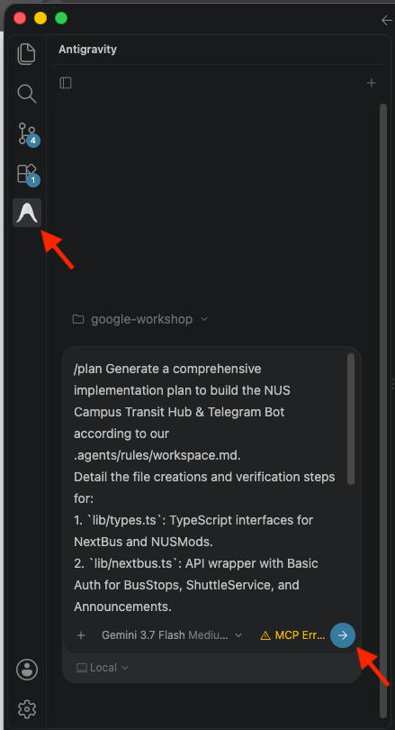

### Reviewing & Executing the Implementation Plan
Antigravity will create the `implementation_plan.md` artifact detailing each component's inputs, outputs, error handling strategies, and verification commands.

Click on `Implementation Plan` in the chat, read through the file created by Antigravity, and once you are satisfied, click **Proceed**.

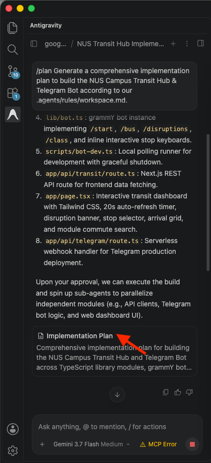

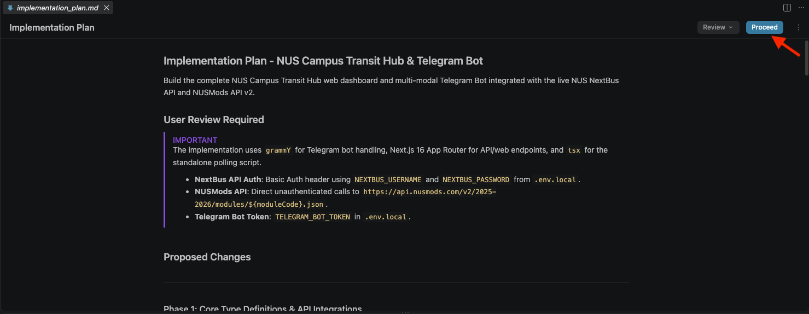

Once you click **Proceed**, Antigravity will autonomously generate all the project files according to the approved plan! In the following phases, we will inspect, test, and verify each layer of the application.

Now let's give Antigravity some time to implement this project on your behalf. Once it's done, click on `Accept all` if prompted to accept all the code changes which Antigravity has made for you.

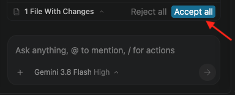

---

## Phase 2: Inspect the Campus Data Layer
Duration: 0:08:00

In this phase, we inspect the core data layer files generated by Antigravity and understand how data flows between the NUS NextBus and NUSMods APIs.

### 🔍 Generated Files Overview
Take a few moments to open and explore each file in VS Code to see how Antigravity structured the data layer:

* **`lib/types.ts`**: Defines strict TypeScript interfaces for bus stops (`BusStop`), live arrival ETAs (`ShuttleService`, `ShuttleEta`), disruption alerts (`Announcement`), and NUSMods module timetables (`ModuleInfo`, `ModuleLesson`).
* **`lib/nextbus.ts`**: Handles authenticated HTTP Basic Auth calls (`NEXTBUS_USERNAME` & `NEXTBUS_PASSWORD`) to the official NUS NextBus API endpoints (`/BusStops`, `/ShuttleService`, `/Announcements`).
* **`lib/nusmods.ts`**: Fetches module schedule data from NUSMods v2 and implements `resolveVenueToBusStop(venue)` using our dictionary in `.agents/rules/workspace.md` to automatically translate campus classrooms (e.g. `COM3-01-23`, `LT27`, `UT-AUD`) to their nearest shuttle stops.

> 💡 **Poke Around**: Open `lib/nusmods.ts` and `lib/nextbus.ts` in your editor. Notice how Next.js caching (`revalidate`) and TypeScript type annotations ensure robust data fetching without runtime exceptions.

---

## Phase 3: Launch & Test the Telegram Transit & Disruption Bot
Duration: 0:15:00

Now let's inspect the Telegram bot implementation generated by Antigravity and launch our local development bot runner.

### How Telegram Bots Work
Telegram bots operate by receiving events (such as user text messages, slash commands, or button clicks) from the Telegram servers:
1. **Long Polling (Development)**: Our local Node.js script continuously asks Telegram *"Are there any new messages?"*. This requires no public domain and works out-of-the-box on localhost.
2. **Webhooks (Production)**: Telegram pushes an HTTP `POST` request directly to our public URL (e.g. `https://your-app.vercel.app/api/telegram`) whenever a user sends a message.

### Why We Use `grammY`
Rather than manually writing low-level HTTP calls to Telegram's raw REST API, we use **`grammY`** — a modern, type-safe TypeScript Telegram framework. `grammY` gives us:
* Clean command listeners (`bot.command('bus', ...)`).
* Rich interactive elements like inline keyboard buttons (`InlineKeyboard`).
* Seamless compatibility with both local long-polling (`bot.start()`) and serverless Edge functions on Vercel (`webhookCallback()`).

### 🔍 Generated Files Overview
Take a few moments to open and examine these files in VS Code:

* **`lib/bot.ts`**: The complete grammY bot definition. It wires up `/start` (with an inline quick-stops keyboard), `/bus <stop>` (with live color-coded ETA badges), `/disruptions` (active breakdown advisories), and `/class <module>` (timetable lookup + nearest bus stop live arrivals).
* **`scripts/bot-dev.ts`**: The local long-polling runner script that starts the bot using `bot.start()`.
* **`package.json`**: Configured with the `"bot:dev": "tsx scripts/bot-dev.ts"` script.

> 💡 **Poke Around**: Open `lib/bot.ts` in VS Code. Check out how `bot.command('class', ...)` combines data from both NUSMods and NUS NextBus in a single chat message!

### 🧪 Terminal Verification & Live Testing
1. In your VS Code terminal, ensure you are inside the `nus-transit-hub` directory, then start the bot runner:
   ```bash
   # If your terminal is at the workspace root, enter the project directory:
   cd nus-transit-hub 2>/dev/null || true

   # Start local bot polling
   npm run bot:dev
   ```

> aside negative
> **Terminal Directory Troubleshooting**:
> * **`ENOENT: Could not read package.json`**: Your terminal is at the workspace root. Run `cd nus-transit-hub` to enter the project directory.
> * **`bash: cd: nus-transit-hub: No such file or directory`**: Your active terminal is already inside `nus-transit-hub`. Simply run `npm run bot:dev` directly without `cd`.

2. You should see a confirmation message indicating the bot is live:
   ```text
   🤖 Starting NUS Transit Telegram Bot in Long-Polling Mode...
   ✅ Telegram Bot @YourBotUsername is LIVE! Send /start in Telegram.
   ```
3. Open Telegram on your smartphone or desktop, start a chat with your bot, and test:
   * Send `/start` and tap the inline buttons.
   * Send `/bus COM3` to view real-time arrivals at COM 3.
   * Send `/disruptions` to view breakdown notices.
   * Send `/class CS2030S` to view the timetable, venue mapping, and live bus ETAs!


---

## Phase 4: Launch & Test the Flashy Web Transit Dashboard
Duration: 0:15:00

Now let's inspect the Web API route and responsive frontend dashboard generated by Antigravity, and launch our local Next.js dev server.

### 🔍 Generated Files Overview
Take a few moments to open and examine these files in VS Code:

* **`app/api/transit/route.ts`**: A Next.js App Router API route (`GET`) that aggregates bus stops, live arrival ETAs for the selected stop, active advisories, and NUSMods module timetable lookups into a unified JSON response for the frontend.
* **`app/page.tsx`**: An interactive React client dashboard styled with modern Tailwind CSS. It features:
  - Header with NUS Transit branding and a live countdown refresh timer.
  - Active Disruption Alert Banner that displays real-time breakdown advisories.
  - Popular Stop Selector Pills (`University Town`, `COM 3`, `Kent Ridge MRT`, `Central Library`, etc.).
  - Live Shuttle Arrival Grid with color-coded urgency badges (🟢 <=3 min, 🟡 4-8 min, 🔴 >8 min) and vehicle license plates.
  - **Smart Commute Search**: Enter any module code (e.g. `CS2030S`, `CS1101S`) to automatically locate the classroom venue, map the nearest bus stop, and show upcoming shuttles.

> 💡 **Poke Around**: Open `app/page.tsx` in VS Code to see how React hooks (`useState`, `useEffect`) and Lucide icons are used to create the arrival board and Smart Commute search.

### 🧪 Web App Verification
1. In your VS Code terminal, stop the active bot process by pressing `Ctrl`+`C` (or click the **+** icon in the terminal panel to open a separate terminal tab).

2. Start the Next.js development server (ensure you are inside `nus-transit-hub`):

```bash
# If opening a new terminal tab, enter the project directory:
cd nus-transit-hub 2>/dev/null || true

# Start the Next.js dev server
npm run dev
```

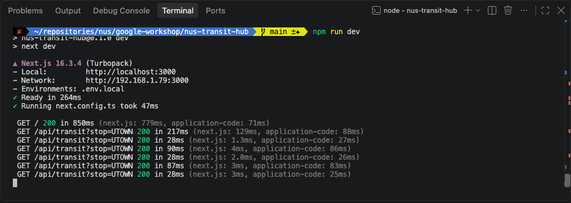

Open `http://localhost:3000` in your web browser:
1. Switch between bus stops (`University Town`, `COM 3`, `Kent Ridge MRT`) and watch the live shuttle arrival cards update dynamically.
2. Type `CS2030S` or `CS1101S` into the Smart Commute search bar and press Enter to see class venue mapping and nearby bus arrival times.

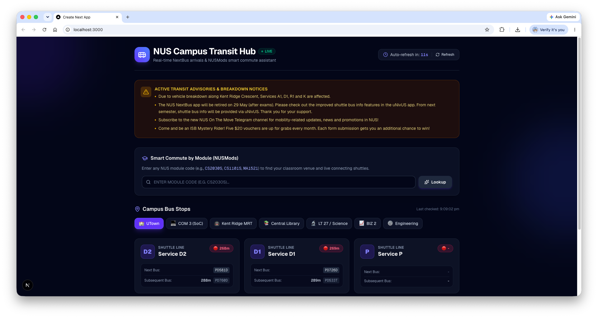

---

## Phase 5: Supercharge Your Agent with Skills & `/grill-me` Design Interview
Duration: 0:08:00

Now that your functional transit hub is running, let's elevate its visual presentation from a standard student project to an award-winning web app.

In this phase, you will learn two advanced Antigravity capabilities:
1. **Agent Skills**: Extending Antigravity's capabilities with specialized design system skills.
2. **Interactive Design Discovery (`/grill-me`)**: Letting Antigravity interview you to capture your creative intent before touching code.

### 1. What Are Agent Skills?
In modern agentic AI, **Skills** are modular packages containing specialized instructions, industry heuristics, and design guidelines that extend your agent's problem-solving toolkit. 

Antigravity automatically discovers and loads skills located in your project's `.agents/skills/` directory.

### 2. Install the Frontend Taste Skill
We will install [`taste-skill`](https://github.com/Leonxlnx/taste-skill) — an open-source collection of design intelligence skills (Minimalist UI, High-End Visual Design, Industrial Brutalism, and Brand Kit).

1. In your VS Code terminal, stop the active bot process by pressing `Ctrl`+`C` (or click the **+** icon in the terminal panel to open a separate terminal tab).

2. In your VS Code terminal (ensure you are inside `nus-transit-hub`), run:

```bash
# If your terminal is at the workspace root, enter the project directory:
cd nus-transit-hub 2>/dev/null || true

# Install taste skill
npx skills add Leonxlnx/taste-skill -y
```

> **Why `-y`?**: The `-y` flag skips interactive prompts and automatically selects all design skills for Antigravity, copying them directly into `.agents/skills/`.

### 3. Trigger the Interactive Design Interview (`/grill-me`)
Instead of trying to write a 500-word prompt detailing exact hex codes and CSS animations, use Antigravity's built-in `/grill-me` slash command. This instructs the agent to ask *you* clarifying questions to uncover your preferred visual aesthetic.

Open the **Antigravity Chat Panel** and prompt:

```text
/grill-me I want to redesign our NUS Transit Hub web dashboard (`app/page.tsx`) using our newly installed taste skills. Grill me with questions about my preferred visual aesthetics, design theme, layout density, and micro-interactions before making any code changes.
```

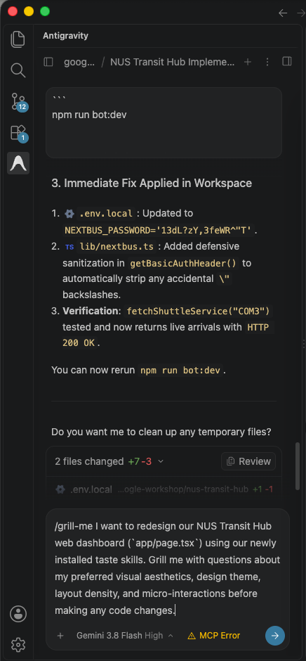

### 4. Answer Antigravity's Questions & Apply the Redesign
1. Antigravity will reply with a short series of design questions (e.g. Minimalist Dark Mode vs Industrial Neo-Brutalist, Glow accents vs Subtle borders, Card layout density).
2. Click on whichever option recommended by Antigravity, or you could even key in your own! Click Continue.

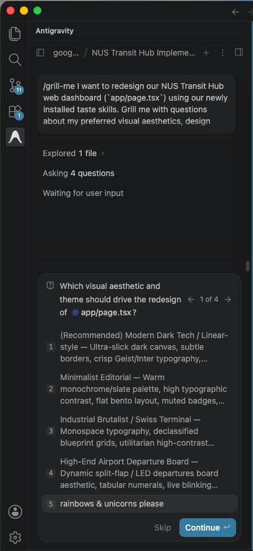

3. Antigravity will just as before sugget an Implementation Plan. Click on Proceed.

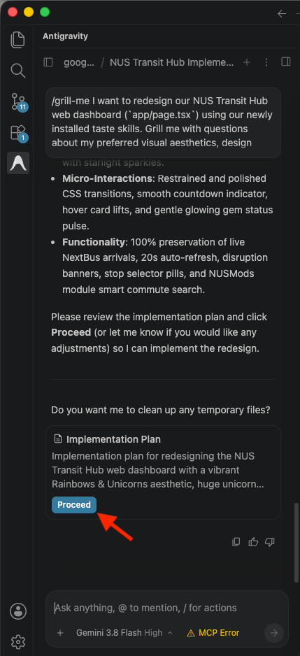

4. Give Antigravity some time to update your design! Antigravity will synthesize your preferences with its installed design skills and refactor `app/page.tsx`. Remember to click `Accept all` if prompted.


5. Start the Next.js development server:

```bash
npm run dev
```

6. Go to `http://localhost:3000` again to witness your custom-tailored design! Is this what you expected? Talk to Antigravity if you would like to tweak anything else.


---

## Phase 6 (Optional Challenge): One-Click Deploy to Vercel (Web + Telegram Webhook)
Duration: 0:08:00

Now that both the Web App and Telegram Bot are working locally, your challenge is to transition your system to production by deploying to **Vercel**.

### 1. What is Vercel?
**Vercel** is the native cloud deployment platform created by the authors of Next.js. It is widely used to host modern web applications.

Why Vercel:
* **Serverless Next.js App Router**: In Next.js, API routes defined in `app/api/...` run as serverless micro-functions. You do not need to configure servers, Linux VMs, or Docker containers.
* **Instant Global Edge Routing**: Every deployment receives a free production URL (e.g., `https://nus-transit-hub.vercel.app`) with automatic SSL/TLS encryption and worldwide CDN caching.
* **Unified Web & Telegram Runtime**: Both your Next.js transit dashboard and your Telegram Bot run on the exact same free cloud tier. This keeps your bot running 24/7 without needing your laptop to stay awake.

### 2. Create a Free Vercel Account
If you don't already have an account, sign up in just a couple of minutes by going to [vercel.com/signup](https://vercel.com/signup). Select the **Hobby** plan (100% free for personal and non-commercial projects) when prompted.

---

### 3. Implement the Telegram Webhook Endpoint
In local development, our bot used long-polling (`scripts/bot-dev.ts`). For 24/7 production on Vercel, we switch to a serverless webhook where Telegram pushes updates directly to our Next.js API route (`/api/telegram`).

#### 🤖 The Agentic Prompt (Antigravity)
Ask Antigravity to create the serverless webhook endpoint:

```text
Create `app/api/telegram/route.ts` as a Next.js App Router POST handler using `webhookCallback(bot, 'std/http')` from `grammy`.
Export POST handler so incoming webhook updates from Telegram are processed serverlessly.
```

#### 📄 Expected Reference Code: `app/api/telegram/route.ts`
```typescript
import { webhookCallback } from 'grammy';
import { bot } from '@/lib/bot';

export const dynamic = 'force-dynamic';

export const POST = webhookCallback(bot, 'std/http');
```

---

### 4. Deploying to Vercel
1. In Visual Studio Code, create a new terminal by going to Terminal > New terminal.


2. Enter our directory by keying into the terminal:

```bash
cd nus-transit-hub
```

3. Log in to Vercel via CLI in your VS Code terminal (no global installation required):
   ```bash
   npx vercel login
   ```
   *(Authorize the CLI in your browser when prompted).*

   > When prompted `Ok to proceed? (y)`, key in `y` and press return.

4. Deploy the application to production:
   ```bash
   npx vercel --prod
   ```
   *(Follow the terminal prompts to set up Vercel, such as setting up a new project. When prompted to Customize settings, indicate `N`).*

5. Add your Environment Variables in the Vercel Dashboard:
   - Go to your [Vercel Dashboard](https://vercel.com/dashboard) and click on your newly created `nus-transit-hub` project.
   - In the left panel, go to **Environment Variables**.

   - Click on `Add Environment Variable`, select `Secret` for type, key in `TELEGRAM_BOT_TOKEN` for `Key`, and paste the value of your Telegram bot token for `Value`. Ensure that `Production` is selected under `Environments`. Click `Save`. 
   - Click on `Add Environment Variable`, select `Secret` for type, key in `NEXTBUS_USERNAME` for `Key`, and key in `NUSnextbus` for `Value`. Ensure that `Production` is selected under `Environments`. Click `Save`. 
   - Click on `Add Environment Variable`, select `Secret` for type, key in `NEXTBUS_PASSWORD` for `Key`, and key in `13dL?zY,3feWR^"T` for `Value`. Ensure that `Production` is selected under `Environments`. Click `Save`. 

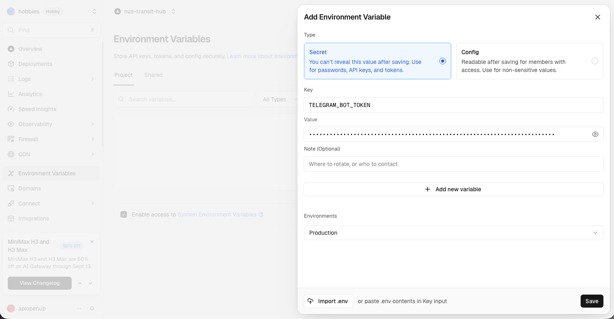

6. Next, go to Deployments, then click on the menu button, and click `Redeploy`.

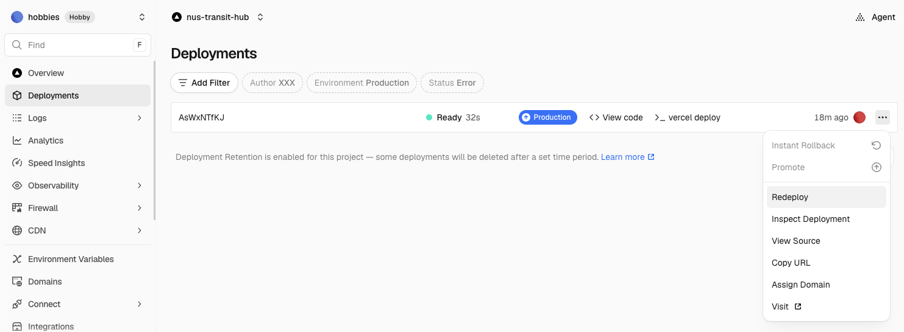

7. Copy your live Vercel `Production` URL (e.g., `https://nus-transit-xxxxxxxxxx-XXXXXXXXXX.vercel.app`).

8. Set the Telegram Webhook:
   Open your web browser (or run in terminal) and navigate to:
   ```text
   https://api.telegram.org/bot<YOUR_BOT_TOKEN>/setWebhook?url=https://<YOUR_VERCEL_APP>.vercel.app/api/telegram
   ```
   *(Replace `<YOUR_BOT_TOKEN>` with your BotFather token, and `<YOUR_VERCEL_APP>` with your actual Vercel project subdomain).*

   Telegram will respond with: `{"ok":true,"result":true,"description":"Webhook was set"}`.

9. Redeploy to Vercel:
   ```bash
   npx vercel --prod --yes
   ```

Your Telegram bot and transit dashboard are now permanently live in the cloud 24/7!

---

## Summary & Next Steps
Duration: 0:02:00

Congratulations! You have built, verified, and deployed a full-stack campus transit intelligence system with Google Antigravity.

### What Was Covered:
* **Rule Anchoring**: Set explicit architecture, venue mappings, and bot/UI specifications in `.agents/rules/workspace.md`.
* **Planning Mode (`/plan`)**: Generated and reviewed `implementation_plan.md` before execution.
* **Campus APIs**: Connected to the live **NUS NextBus API** and **NUSMods API v2**.
* **Telegram Bot**: Implemented a responsive bot using `grammY` supporting both local polling and serverless webhooks.
* **Modern Web Dashboard**: Built a live arrival countdown board and venue-to-bus stop commute finder with Next.js 14 and Tailwind CSS.
* **Agent Skills & Interactive Discovery (`/grill-me`)**: Supercharged Antigravity with `taste-skill` and conducted an interactive design interview to iteratively restyle the UI.
