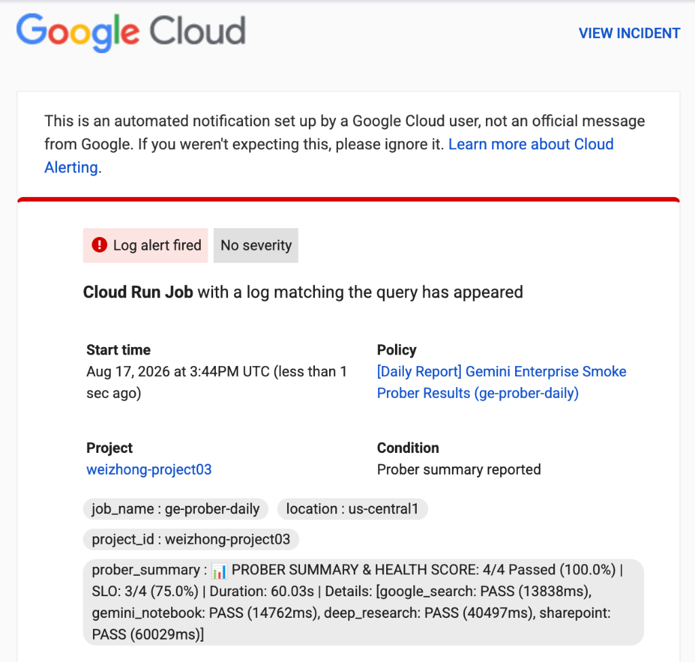

# 🚀 Gemini Enterprise Synthetic Prober (`ge-prober`)

A high-performance, containerized Go synthetic monitoring tool and smoke prober for **Gemini Enterprise (Discovery Engine)** applications and multimodal knowledge bases.

---

## ⭐ Recommended Architecture: Serverless Cloud Run Job with Cloud Scheduler

> [!TIP]
> **Production Best Practice**: Deploying `ge-prober` as a **Google Cloud Run Job** triggered by **Cloud Scheduler** is the **strongly recommended deployment model**.
> - **Zero Server Maintenance**: Purely serverless container execution that scales to zero between runs.
> - **Continuous Proactive Monitoring**: Detects silent backend breakages, connector sync failures, and latency spikes before end-users notice.
> - **Native GCP Security**: Uses Google Cloud Workload Identity / IAM Service Account tokens automatically (no static API keys or long-lived credentials to rotate).

```
  ┌──────────────────────┐         HTTP POST Trigger          ┌───────────────────────────┐
  │   Cloud Scheduler    │ ─────────────────────────────────> │      Cloud Run Job        │
  │  (Daily / Scheduled) │                                    │   (ge-prober Container)   │
  └──────────────────────┘                                    └─────────────┬─────────────┘
                                                                            │ StreamAssist
                                                                            ▼
                                                              ┌───────────────────────────┐
                                                              │ Gemini Enterprise Backend │
                                                              │  (Discovery Engine APIs)  │
                                                              └───────────────────────────┘
```

### ⚡ Deployment, Scheduling & Cloud Monitoring Alerting Setup

`deploy_job.sh` provides a fully parameterized, idempotent deployment, scheduler configuration, and Cloud Monitoring alerting workflow for Google Cloud Run, Cloud Scheduler, and Cloud Monitoring.

#### 1. Quick Start (Default Settings: Twice Daily at 09:00 & 17:00 SGT, Alerts to `weizhongt@google.com`)
```bash
./deploy_job.sh --project="YOUR_GCP_PROJECT_ID" --engine-id="YOUR_ENGINE_ID"
```

#### 2. Advanced Parameterized Deployment
Customize your schedule, time zone, dedicated service account, alert recipient, alert mode, and job names via CLI flags or environment variables:
```bash
./deploy_job.sh \
  --project="my-gcp-project" \
  --region="us-central1" \
  --engine-id="ge-global-prober_1786960389717" \
  --location="global" \
  --job-name="ge-prober-daily" \
  --scheduler-name="trigger-ge-prober-daily" \
  --schedule="0 9,17 * * *" \
  --time-zone="Asia/Singapore" \
  --service-account="prober-runner@my-gcp-project.iam.gserviceaccount.com" \
  --alert-email="weizhongt@google.com" \
  --alert-mode="all" \
  --grant-iam
```

#### 3. Standalone Management Modes
Update individual components without rebuilding containers or redeploying Cloud Run:

```bash
# Update schedule to run every 30 minutes in Singapore Time (SGT, GMT+8)
./deploy_job.sh --only-scheduler --schedule="*/30 * * * *" --time-zone="Asia/Singapore"

# Update or configure only Cloud Monitoring email alerts (all runs vs failure-only)
./deploy_job.sh --only-alerting --alert-email="team-alerts@example.com" --alert-mode="all"

# Dry run / preview planned commands before executing
./deploy_job.sh --dry-run --schedule="0 9,17 * * *" --alert-email="weizhongt@google.com"
```

#### 4. Deployment Script CLI Flags Reference
| Flag | Short | Env Variable | Default | Description |
| :--- | :--- | :--- | :--- | :--- |
| `--project` | `-p` | `GCP_PROJECT_ID` | `weizhong-project03` | Target Google Cloud Project ID |
| `--region` | `-r` | `GCP_REGION` | `us-central1` | Cloud Run execution region |
| `--engine-id` | `-e` | `GE_ENGINE_ID` | `ge-global-prober_1786960389717` | Gemini Enterprise Discovery Engine ID |
| `--location` | `-l` | `GE_LOCATION` | `global` | Discovery Engine location |
| `--job-name` | `-j` | `JOB_NAME` | `ge-prober-daily` | Cloud Run Job name |
| `--scheduler-name` | `-n` | `SCHEDULER_JOB_NAME` | `trigger-<JOB_NAME>` | Cloud Scheduler Job name |
| `--schedule` | `-s` | `SCHEDULE_CRON` | `0 9,17 * * *` | Cron schedule expression (twice daily) |
| `--time-zone` | `-z` | `TIME_ZONE` | `Asia/Singapore` | Time zone (e.g. `Asia/Singapore` GMT+8, `UTC`) |
| `--service-account` | `-a` | `SCHEDULER_SA_EMAIL` | Active compute SA | Service account email for Cloud Scheduler invocation |
| `--alert-email` | `-m` | `ALERT_EMAIL` | `weizhongt@google.com` | Recipient email for Cloud Monitoring alerts |
| `--alert-mode` | | `ALERT_MODE` | `all` | Alert mode: `all` (summary of all runs) or `failure-only` |
| `--grant-iam` | | | `false` | Automatically grant `roles/run.invoker` to the service account |
| `--dry-run` | | | `false` | Print resolved configs and exact `gcloud` commands without executing |
| `--skip-build` | | | `false` | Deploy Cloud Run Job using existing image tag (skips Cloud Build) |
| `--only-scheduler` | | | `false` | Update only Cloud Scheduler trigger (skips build and job deployment) |
| `--only-alerting` | | | `false` | Configure or update Cloud Monitoring Notification Channel & Alert Policy only |
| `--help` | `-h` | | | Show full usage guide and flag descriptions |

#### 5. Automated Email Alerts & Results Breakdown
When configured with `--alert-email="YOUR_EMAIL"` (default: `weizhongt@google.com`), Cloud Monitoring automatically sends an email report for each scheduled run containing the full pass/fail statistics, total execution time, and per-probe latency breakdown directly in your inbox:

<p align="center">
  
</p>

- **Extracted Summary**: The email body displays the health score and per-probe status (`[google_search: PASS (13838ms), gemini_notebook: PASS (14762ms), deep_research: PASS (40497ms), sharepoint: PASS (60029ms)]`).
- **Direct Links**: Includes clickable links to the Cloud Monitoring incident and Logs Explorer for full interactive streaming traces.

#### 6. Manual Execution & Logging
- **Trigger an on-demand run**:
  ```bash
  gcloud run jobs execute ge-prober-daily --project="YOUR_GCP_PROJECT_ID" --region="us-central1" --wait
  ```
- **View logs in terminal**:
  ```bash
  gcloud logging read "resource.type=cloud_run_job AND resource.labels.job_name=ge-prober-daily" --limit=50 --format="value(textPayload)"
  ```


---

## 💻 Alternative: Local Workstation & Ad-Hoc CLI Testing

For local development or testing without deploying to Cloud Run, `ge-prober` can be run directly on your workstation using any of the following configuration options (resolved via 12-factor precedence: `Flags > Env Vars > .env > config.json > Defaults`):

### Option A: Local `.env` File *(Recommended for Developers)*
Copy [`.env.example`](./.env.example) to `.env`:
```bash
GCP_PROJECT_ID=YOUR_GCP_PROJECT_ID
GE_LOCATION=global
GE_ENGINE_ID=YOUR_GEMINI_ENTERPRISE_ENGINE_ID
GE_DATA_STORE_IDS=datastore_1,datastore_2
GE_MAX_CONCURRENCY=4
```
Run:
```bash
./ge-prober
```

### Option B: Local `config.json` File
Copy [`config.example.json`](./config.example.json) to `config.json`:
```json
{
  "project_id": "YOUR_GCP_PROJECT_ID",
  "location": "global",
  "engine_id": "YOUR_GEMINI_ENTERPRISE_ENGINE_ID",
  "assistant_id": "default_assistant",
  "timeout_seconds": 180,
  "max_concurrency": 4,
  "data_store_ids": [
    "YOUR_DATA_STORE_ID_1",
    "YOUR_DATA_STORE_ID_2"
  ]
}
```
Run:
```bash
./ge-prober
```

### Option C: Direct CLI Flags *(One-Liners & CI/CD)*
```bash
./ge-prober \
  -project="YOUR_GCP_PROJECT_ID" \
  -engine="YOUR_GEMINI_ENTERPRISE_ENGINE_ID" \
  -region="global" \
  -datastores="datastore_1,datastore_2" \
  -concurrency=4
```

#### Complete CLI Flag Reference:
| Flag | Description | Default |
| :--- | :--- | :--- |
| `-project` | Target GCP Project ID | From config / env |
| `-location` / `-region` | Discovery Engine location (`global`, `us`, `eu`, etc.) | `global` |
| `-engine` | Target Gemini Enterprise Engine / App ID | From config / env |
| `-assistant` | Assistant ID | `default_assistant` |
| `-datastores` | Comma-separated list of Data Store IDs | `""` |
| `-concurrency` | Number of concurrent workers | `4` |
| `-timeout` | Per-probe timeout in seconds | `180` |
| `-test-cases` | Path to custom test suite JSON file | `test_cases/smoke_test_cases.json` |
| `-output` | Path to export JSON results report | `smoke_prober_results.json` |
| `-config` | Path to custom JSON configuration file | `config.json` |
| `-token` | GCP Access token override | Automatic ADC / Service Account |

---

## 📝 Customizing & Adding Test Queries

You can easily customize queries or add new test cases in **2 ways**:

### 1. Edit the Default Test Suite
Edit [`test_cases/smoke_test_cases.json`](./test_cases/smoke_test_cases.json) directly.

Each test case adheres to the following structure:
```json
[
  {
    "id": "smoke_m365_sharepoint_01",
    "title": "SharePoint Document Retrieval",
    "subsystem": "sharepoint",
    "query": "Find the workplace policy document in our SharePoint site.",
    "grounding_type": "vertex_ai_search",
    "slo_targets": {
      "max_ttft_ms": 60000.0,
      "max_ttlt_ms": 90000.0
    },
    "assertions": {
      "must_contain_keywords": ["policy", "SharePoint"],
      "forbidden_errors": ["401", "403", "500", "503", "USER_PROJECT_DENIED"],
      "must_have_citations": true
    }
  }
]
```

### 2. Point to a Custom Test Catalog File
Maintain separate test suites (e.g. `prod_queries.json`, `hr_tests.json`) and pass the path using `-test-cases`:

```bash
./ge-prober -test-cases="path/to/custom_queries.json"
```

### 📋 Grounding Type Reference:
| `grounding_type` | Subsystem Targeted | Backend Behavior |
| :--- | :--- | :--- |
| **`vertex_ai_search`** | Enterprise Connectors | Queries attached enterprise data stores (SharePoint, OneDrive, Confluence, Jira, BigQuery). |
| **`deep_research_agent`** | Deep Research Agent | Injects `agentsSpec: { agentSpecs: [{ agentId: "deep_research" }] }` with web grounding for multi-step research plans. |
| **`gemini_notebook`** | Gemini Notebook | Queries the notebook workspace knowledge base directly without external connectors. |
| **`web_search`** | Google Search | Injects `toolsSpec: { webGroundingSpec: {} }` for real-time public web search facts. |

---

## 🔐 Authentication
The prober automatically manages authentication across environments:
1. **Cloud Run / GKE**: Automatically uses the attached Service Account metadata token (requires `roles/discoveryengine.editor` or `roles/discoveryengine.admin`).
2. **Local Workstations**: Automatically uses Application Default Credentials (`gcloud auth application-default login`).
3. **CI/CD / Custom Pipelines**: Pass `$GCP_ACCESS_TOKEN` in the environment or `-token="ya29..."`.

---

## 📊 Sample Execution Output
```
================================================================================
🚀 GEMINI ENTERPRISE SYNTHETIC SMOKE TEST PROBER (Go)
================================================================================
🎯 Target Project : my-gcp-project
📍 Location / Reg : global
⚙️ Target Engine  : my-gemini-app
📦 Smoke Probes   : 4 test cases
⚡ Concurrency    : 4 parallel workers
================================================================================

✅ [gemini_notebook] Gemini Notebook Knowledge Base Q&A     | TTFT: 14132.8ms | TTLT: 14132.8ms
✅ [google_search] Public Google Search Web Grounding       | TTFT: 15118.3ms | TTLT: 15118.3ms
✅ [deep_research] Deep Research Multi-Step Plan & Synthesis | TTFT: 37596.5ms | TTLT: 37596.5ms
✅ [sharepoint] SharePoint Document Retrieval               | TTFT: 40138.1ms | TTLT: 40138.1ms

================================================================================
📊 PROBER SUMMARY & HEALTH SCORE: 4/4 Passed (100.0%) | SLO: 4/4 (100.0%) | Duration: 40.14s | Details: [gemini_notebook: PASS (14133ms), google_search: PASS (15118ms), deep_research: PASS (37596ms), sharepoint: PASS (40138ms)]
================================================================================
Total Duration       : 40.14s
Functional Pass Rate : 4/4 (100.0%)
SLO Compliance Rate  : 4/4 (100.0%)
Report Exported To   : smoke_prober_results.json
================================================================================
Container called exit(0).
```
