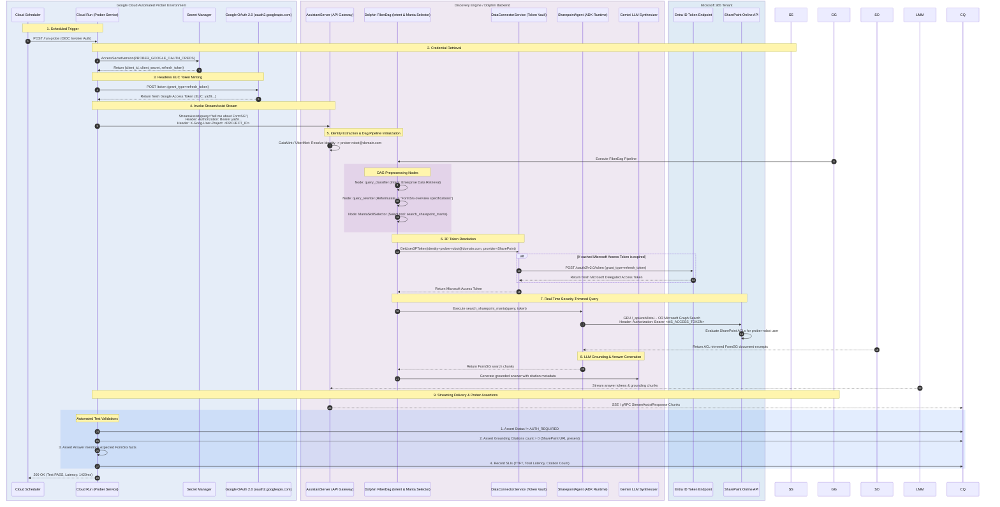

# Automated Headless Prober & Regression Testing Architecture for Gemini Enterprise Federated Connectors

**Date:** August 19, 2026  
**Target System:** Gemini Enterprise (Discovery Engine) `StreamAssist` / `Assist`  
**Target Connectors:** Microsoft SharePoint Online Federated Connector, Google Workspace Connectors  
**Execution Environment:** Cloud Run scheduled via Cloud Scheduler  

---

## 1. Overview & Problem Statement

When building an automated synthetic prober or regression test suite running on **Cloud Run** (triggered by **Cloud Scheduler**) to validate **Gemini Enterprise (Discovery Engine)**, automated testing must query both internal models and live enterprise data connectors (such as Microsoft SharePoint Online and Google Drive).

A typical prober scenario:
* **Query:** `"tell me about FormSG"`
* **Expected Result:** The federated SharePoint connector locates the document in the tenant in real time, applies user-level Access Control Lists (ACLs), grounds the Gemini model response, and returns citations with document URLs.

However, standard automated background runners on Cloud Run rely on the default **Compute Service Account (Application Default Credentials / ADC)**. When querying federated connectors with this service account token, the call returns **0 results**, a refusal, or an `AUTH_REQUIRED` stream payload.

---

### 2. Core Architectural Constraint: Delegated Permissions vs Machine Identities

### Why Cloud Run Service Accounts Fail

| Dimension | End-User Identity (EUC) | Cloud Run Service Account (SA) |
| :--- | :--- | :--- |
| **OAuth Grant Type** | `authorization_code` / `refresh_token` (Delegated User Auth) | `client_credentials` / Workload Identity |
| **DataConnectorService Keying** | Matched to human/synthetic user profile (Gaia ID / WIF subject) | **Key not found**; SAs do not have interactive 3P consent sessions |
| **SharePoint API Scopes** | `AllSites.Read`, `Sites.Search.All` (on behalf of user) | Lacks delegated user context |
| **Failure Mode** | Returns grounded answers with citations | Returns `0 results`, refusal, or `AUTH_REQUIRED` stream payload |
| **Identity Chaining** | Forwarded end-to-end | **Broken delegation** ("Confused Deputy" / truncated user context) |


### Key Underlying Concepts:
1. **End User Credentials (EUC):** An OAuth 2.0 Access Token representing a human or synthetic user identity (`ya29...` or WIF federated principal). In Discovery Engine, EUC is required for federated connectors because the backend extracts the caller identity from the `Authorization` header to look up that specific user's pre-consented Microsoft OAuth tokens.
2. **DataConnectorService:** The foundational Discovery Engine service responsible for lifecycle management, OAuth token vaulting, and runtime token brokering. It securely vaults third-party access and refresh tokens **strictly indexed by the caller's Google Identity (Gaia ID) or WIF subject**.

---

## 3. API Selection: `StreamAssist` vs. `Assist`

| Feature | `AssistantService.StreamAssist` | `AssistantService.Assist` |
| :--- | :--- | :--- |
| **Architecture** | **FiberDag Runtime** (Directed Acyclic Graph) | Legacy blocking `CorePlannerStrategy` |
| **Interaction Model** | Server-Side Streaming (SSE / gRPC stream) | Unary Request / Response |
| **Intent Classification & Routing** | Dynamic execution via `query_classifier` DAG node | Basic heuristic routing |
| **Query Rewriting (DRIP)** | Fully supported via Query Reformulation DAG nodes | Not executed via DAG hooks |
| **Manta Tools Integration** | Native via `MantaSkillSelector` (`search_sharepoint_manta`) | Bound to core planner limits |

> **Prober Recommendation:** Always target **`AssistantService.StreamAssist`** in probers and regression test suites to validate true production behavior, query rewriting, and Manta tool dispatch.

---

## 4. Headless Authentication Architectures for Federated SharePoint

### Architecture A: Single Dedicated Test User (OAuth Refresh Token Pattern - Non-WIF) - *Recommended*

This is the cleanest approach when Workforce Identity Federation (WIF) is not configured and Ingested Mode is not an option.

```
+-----------------------------------------------------------------------------------------+|
NON-WIF HEADLESS FEDERATED AUTHENTICATION FLOW                           |
|                                                                                  |
|  [Phase 1: One-Time Manual Bootstrap]                                              |
|  1. Create Google Workspace / Cloud Identity user: prober-robot@yourdomain.com                                                                                         |
|  2. Create OAuth Client ID in GCP Console and mint a Google OAuth Refresh Token for this user       |
|  3. Log in once to Gemini Enterprise Web UI as prober-robot and Authorize SharePoint (Microsoft JIT)|
|     ===> Google DataConnectorService vaults Microsoft refresh token mapped to prober-robot          |
|                                                                                  |
|  [Phase 2: Automated Headless Cloud Run Execution]                                    |
|  1. Cloud Scheduler triggers Cloud Run Prober                                            |
|  2. Cloud Run reads Google {client_id, client_secret, refresh_token} from Secret Manager           |
|  3. Cloud Run calls: POST https://oauth2.googleapis.com/token (grant_type=refresh_token)            |
|     ===> Receives fresh 1-hour Google Access Token (EUC ya29...)                                 |
|  4. Cloud Run calls: AssistantService.StreamAssist                                           |
|     Headers: Authorization: Bearer <ya29_token>                                                 |
|     ===> Discovery Engine fetches vaulted SharePoint token for prober-robot, queries SharePoint,     |
|          and returns live grounded results                                                     |
+----------------------------------------------------------------------------------------+
```

### Architecture B: Workforce Identity Federation (WIF) with Microsoft Entra ID

For organizations authenticating end users into Google Cloud via Microsoft Entra ID:

1. **Synthetic Prober in Entra ID:** Create `svc-gemini-prober@yourdomain.com`.
2. **One-Time Consent:** Log in once via Gemini Enterprise Web UI and complete SharePoint consent.
3. **Headless Execution in Cloud Run:**
   * Fetch Entra ID credentials from Secret Manager.
   * Call Entra ID token endpoint: `POST https://login.microsoftonline.com/{tenant_id}/oauth2/v2.0/token` with ROPC grant (`grant_type=password`) to obtain an Entra ID OIDC id_token.
   * Exchange id_token at Google Cloud STS (`https://sts.googleapis.com/v1/token`) for a federated Google Access Token.
   * Call `StreamAssist` with `Authorization: Bearer <federated_google_token>`.

---

## 5. First-Party (1P) Google Workspace Connectors vs. 3P Connectors

| Dimension | Third-Party (SharePoint, Jira, Salesforce) | First-Party Google Workspace (Drive, Gmail) |
| :--- | :--- | :--- |
| **Identity Namespace** | Heterogeneous (External IDs / Entra GUIDs) | Unified (Native Google Cloud Identity / Gaia) |
| **Translation Layer** | Requires Identity Mapping Stores | None required; 1:1 match |
| **Initial Consent** | Interactive 3P OAuth consent popup required | Zero interactive consent required (Admin DwD or 3LO) |
| **Token Brokering** | `DataConnectorService` vaults and refreshes 3P tokens | Direct Google-internal 1P authorization |
| **ACL Evaluation** | Ingested ACLs or real-time Microsoft Graph evaluation | Native Google Drive ACLs and Google Groups |


### Domain-Wide Delegation (DwD) vs. Non-DwD for Google Workspace
* **Domain-Wide Delegation (DwD):j* A Workspace Super Admin authorizes a Service Account to impersonate *any** user in the domain for specific scopes via JWT signing. High privilege, broad blast radius.
* **Non-DwD Alternative (Recommended for least privilege):** Use a standard 3-Legged OAuth (3LO) Refresh Token for a single dedicated test user (`gemini-prober@domain.com`). The prober can only access files explicitly shared with that single account.

---

## 6. End-to-End Under-The-Hood Execution Diagram



---

## 7. Production Python Prober Code

```python
import os
import json
import time
import requests
from google.cloud import secretmanager
from google.cloud import discoveryengine_v1 as discoveryengine
from google.oauth2 import credentials

def get_prober_access_token() -> str:
    """Exchange Google OAuth refresh token from Secret Manager for a fresh EUC token."""
    sm = secretmanager.SecretManagerServiceClient()
    secret_name = os.environ["PROBER_OAUTH_SECRET_ID"]
    secret_payload = sm.access_secret_version(name=secret_name).payload.data.decode("utf-8")
    creds_data = json.loads(secret_payload)
    
    resp = requests.post(
        "https://oauth2.googleapis.com/token",
        data={
            "client_id": creds_data["client_id"],
            "client_secret": creds_data["client_secret"],
            "refresh_token": creds_data["refresh_token"],
            "grant_type": "refresh_token",
        },
        timeout=10,
    )
    resp.raise_for_status()
    return resp.json()["access_token"]

def run_sharepoint_prober():
    project_id = os.environ["GCP_PROJECT_ID"]
    engine_id = os.environ["ENGINE_ID"]
    location = os.environ.get("LOCATION", "global")
    
    # 1. Obtain EUC Google Access Token
    user_access_token = get_prober_access_token()
    user_creds = credentials.Credentials(token=user_access_token)
    
    client_options = {}
    if location != "global":
        client_options["api_endpoint"] = f{location}-discoveryengine.googleapis.com
        
    client = discoveryengine.AssistantServiceClient(
        credentials=user_creds,
        client_options=client_options
    )
    
    name = f"projects/{project_id}/locations/{location}/collections/default_collection/engines/{engine_id}/assistants/default_assistant"
    
    request = discoveryengine.StreamAssistRequest(
        name=name,
        query=discoveryengine.Query(text="tell me about FormSG"),
    )
    
    start_time = time.time()
    first_token_time = None
    full_text = ""
    citations = []
    auth_required = False
    
    # 2. Consume StreamAssist stream
    responses = client.stream_assist(requests=iter([request]))
    
    for resp in responses:
        if first_token_time is None:
            first_token_time = time.time() - start_time
            
        if resp.answer and resp.answer.replies:
            for reply in resp.answer.replies:
                full_text += reply.content
                
        if resp.answer and resp.answer.grounded_content:
            citations.extend(resp.answer.grounded_content)
            
        if hasattr(resp, "auth_required") and resp.auth_required:
            auth_required = True
            
    total_latency = time.time() - start_time
    
    # 3. Assertions
    if auth_required:
        raise RuntimeError("PROBER FAILURE: AUTH_REQUIRED received. Microsoft refresh token needs re-consent.")
        
    assert len(citations) > 0, "PROBEF FAILURE: No SharePoint grounding citations returned."
    assert "FormSG" in full_text, f"PROBER FAILURE: Response did not contain expected content. Got: {full_text}"
    
    result = {
        "status": "PASS",
        "ttft_ms": round(first_token_time * 1000, 2) if first_token_time else 0,
        "total_latency_ms": round(total_latency * 1000, 2),
        "citations_count": len(citations),
        "response_length": len(full_text),
    }
    print(json.dumps(result, indent=2))
    return result

if __name__ == "__main__":
    run_sharepoint_prober()
```

---

## 8. Best Practices & Runbook
1. **Dedicated Test Canary Site:** Create a dedicated SharePoint site (e.g. `https://tenant.sharepoint.com/sites/CanaryProberSite`) containing controlled documents. Restrict the prober test user's ACL exclusively to this site.
2. **Handling `AUTH_REQUIRED` Alerts:** If tenant policies revoke the Microsoft refresh token, `StreamAssist` streams an `AUTH_REQUIRED` state with an `authorizationUri`. Configure Cloud Monitoring to alert on `status == "AUTG_REQUIRED"`. Runbook: Sign into Gemini Enterprise Web UI as prober-robot@domain.com and click "Authorize" on SharePoint to re-vault the token.
3. **Entra ID Conditional Access Exclusion:** Ensure Microsoft Entra ID Conditional Access rules exclude the synthetic test user from interactive MFA challenges when calling from Google Cloud egress IP ranges.