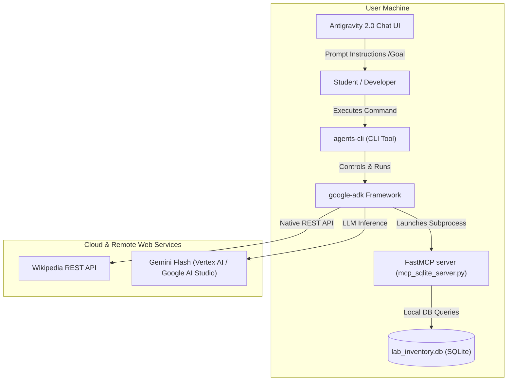
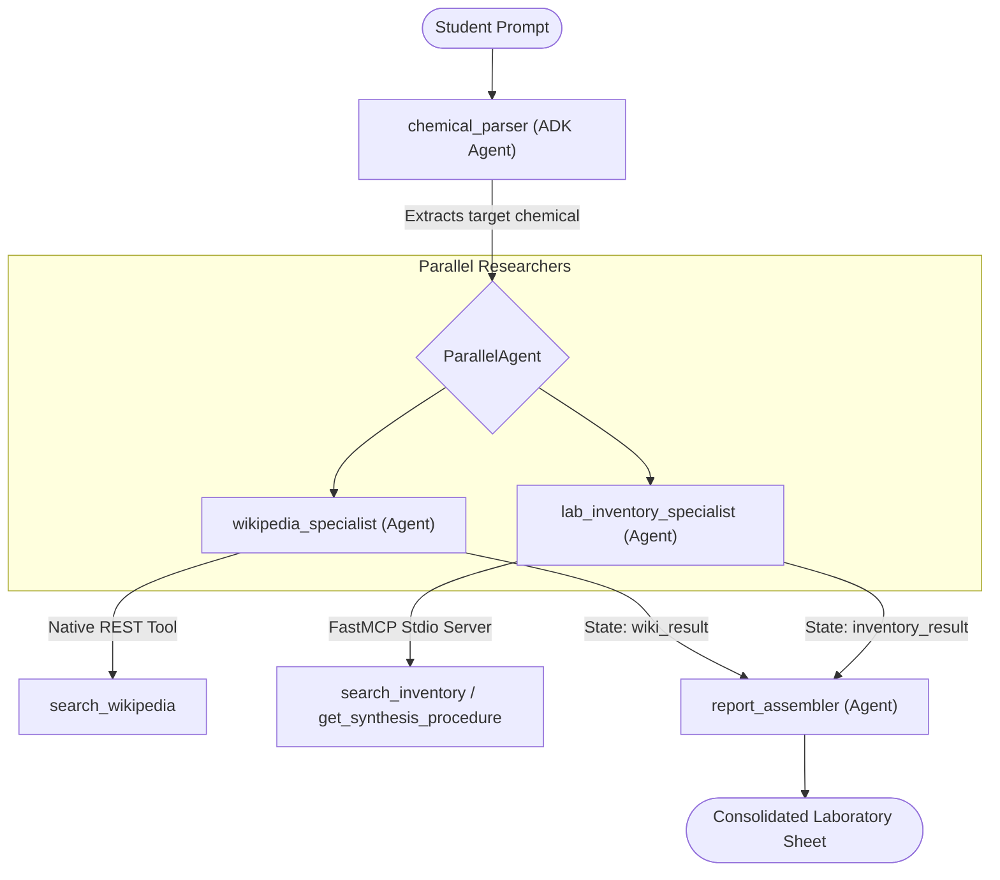

# Organic Chemistry Parallel Multi-Agent Companion

Welcome to the **Organic Chemistry Parallel Multi-Agent Companion** repository. This is an advanced AI assistant designed to help laboratory students and researchers concurrently perform academic research (via Wikipedia REST APIs) and check physical inventory levels, shelf storage locations, CAS numbers, and standard synthetic reaction procedures (via a local SQLite database).

This project is built using **Google's Agent Development Kit (ADK)**, orchestrated using **`agents-cli`**, and integrated with external data stores using the **Model Context Protocol (MCP)**.

---

## 📊 System Diagrams

### 1. Developer Tooling & Lifecycle Workflow
This diagram illustrates how various software engineering and agentic tooling layers integrate in this repository, from the developer's Antigravity IDE down to the underlying database and external APIs:



---

### 2. Parallel Multi-Agent Orchestration Architecture
This diagram illustrates how incoming student queries are processed concurrently across specialized researchers before being synthesized into a safe, comprehensive laboratory guide sheet:



---

## 📁 Repository Structure

```
organic-chem-agent/
├── app/                      # Core agent code
│   ├── agent.py              # Main parallel/sequential agent orchestration definition
│   └── agent_runtime_app.py  # Agent Runtime application wrapper
├── tests/                    # Evaluation, integration, and unit tests
│   └── eval/                 # Evaluation dataset & metrics
│       ├── datasets/         # Test scenarios (chemistry_dataset.json)
│       └── eval_config.yaml  # Correctness and Safety metrics definition
├── init_db.py                # Database seeding script (creates lab_inventory.db)
├── wikipedia_tool.py         # Native ADK Wikipedia scraper tool
├── mcp_sqlite_server.py      # FastMCP SQLite database tool server
├── lab_inventory.db          # SQLite Local database storing chemistry inventory and steps
├── CODELAB.md                # Full Google Codelab lesson guide for NTU students
├── README.md                 # Project Overview (This file)
├── GEMINI.md                 # Agentic coding instructions & commands guide
└── pyproject.toml            # Dependencies and build definitions
```

---

## ⚡ Quick Start

### 1. Environment Initialization
Set up your virtual environment and install the locked dependencies using PyPI:
```bash
uv sync --default-index https://pypi.org/simple
```

### 2. Initialize the Database
Populate your local university chemistry laboratory SQLite database with raw materials and synthetic recipes:
```bash
.venv/bin/python init_db.py
```

### 3. Run the Parallel Agent
Ensure you have authenticated Google Application Default Credentials (ADC) or set your API key, then invoke the pipeline on a compound:
```bash
# Authenticate
gcloud auth application-default login

# Execute
agents-cli run "aspirin"
```

### 4. Open the Web Playground
Launch the high-fidelity interactive chat interface to witness parallel agent transfers and lookups:
```bash
agents-cli playground
```

### 5. Evaluate the Agent
Verify correctness and safety rating guidelines using LLM-as-a-judge:
```bash
agents-cli eval run --dataset tests/eval/datasets/chemistry_dataset.json
```
