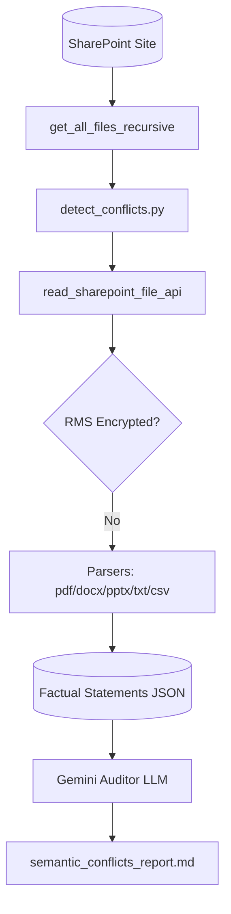

# 🚨 SharePoint Semantic Conflict Auditor

The conflict analysis module performs a deep semantic audit across your entire unencrypted document corpus to group files by topic and discover logical contradictions or clashing guidelines (such as discrepancies in HR guidelines, cybersecurity procedures, or LLM playbook drafts).

---

## 🏗️ System Flow



---

## 📁 Components

### 1. Conflict Auditor (`detect_conflicts.py`)
Executes the following pipeline:
1.  **Traverse and Parse**: Identifies and reads the text content of all unencrypted, readable documents.
2.  **Fact Indexing**: Invokes a Gemini prompt for each file to extract a concise bulleted list of the core actionable rules, guidelines, operating procedures, or factual commitments, compiling them into `/analyse_conflict/semantic_conflicts.json`.
3.  **Clustering and Semantic Audit**: Passes the consolidated factual statements index to Gemini to:
    *   Group the files into logical **semantic content clusters** (topics).
    *   Auditing: Compare the statements across files within each cluster to detect **direct contradictions or semantic conflicts** (e.g. inconsistent mobile accessibility policies, or clashing LLM playbook draft statuses).
    *   Compile a detailed executive report in **`analyse_conflict/semantic_conflicts_report.md`** highlighting conflict titles, conflicting files, the contradiction details, and recommended actions.

---

## 🚀 Execution Guide

Ensure your virtual environment is active:
```bash
source .venv/bin/activate
```

### Running the Semantic Conflict Audit
To extract factual statements, cluster files, and audit semantic policy conflicts:
```bash
python analyse_conflict/detect_conflicts.py
```
*   *Output Report*: `analyse_conflict/semantic_conflicts_report.md`
*   *Factual Statements Index*: `analyse_conflict/semantic_conflicts.json`
