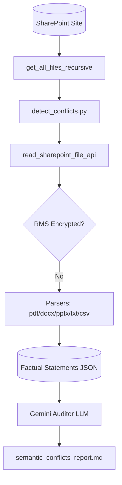

# 🚨 SharePoint Semantic Conflict Auditor

This tool scans all your unencrypted files, groups them by topic, and finds conflicting rules or instructions (like clashing HR policies or security guidelines).

---

## 🏗️ System Flow



---

## 📁 Components

### 1. Conflict Auditor (`detect_conflicts.py`)
Runs these steps:
1.  **Scan and Parse**: Reads text from all unencrypted, readable files.
2.  **Fact Indexing**: Uses Gemini to extract a simple list of rules, guidelines, and procedures from each file. Saves them in `analyse_conflict/semantic_conflicts.json`.
3.  **Conflict Audit**: Sends the full facts index to Gemini to:
    *   Group files by topic.
    *   Compare statements within each topic to find conflicting rules (e.g. clashing telecommuting rules or different security guidelines).
    *   Write a clear report in **`analyse_conflict/semantic_conflicts_report.md`** showing conflict names, files, details, and recommended fixes.

---

## 🤖 ADK Agent Integration

*   **`detect_conflicts.py`**: **Does NOT** use the ADK Agent. It is a standalone batch tool that runs offline. It scans files via the SharePoint API and calls Gemini (`google.genai.Client`) directly to index facts and group conflicts.

---

## 🚀 Execution Guide

Make sure your virtual environment is active:
```bash
source .venv/bin/activate
```

### Run the Semantic Conflict Audit
To scan files, group them, and find policy conflicts:
```bash
python analyse_conflict/detect_conflicts.py
```
*   *Output Report*: [analyse_conflict/semantic_conflicts_report.md](file:///Users/weizhongt/coding/agentic-demos/sharepoint_eval/analyse_conflict/semantic_conflicts_report.md)
*   *Factual Statements Index*: `analyse_conflict/semantic_conflicts.json`
