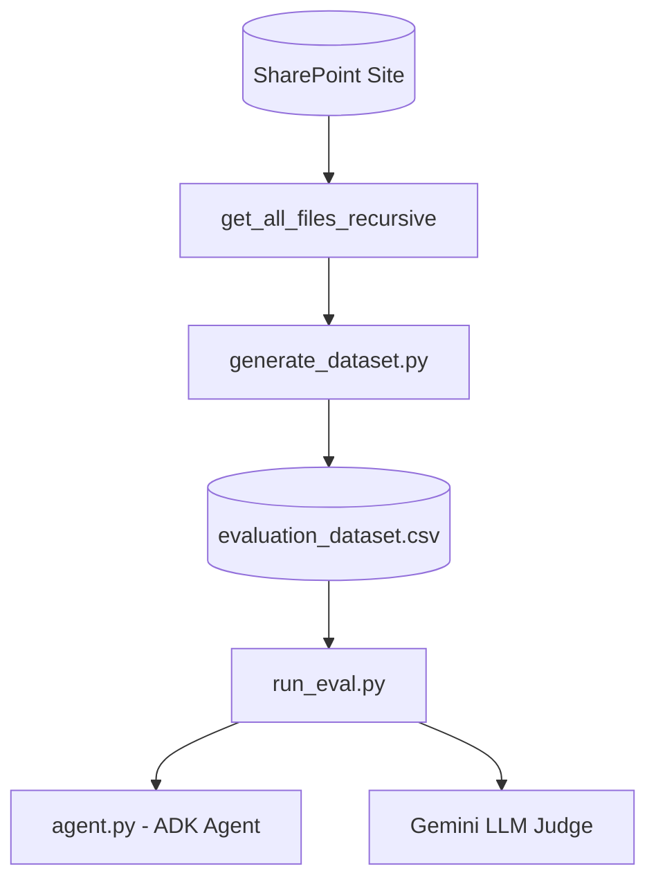

# 🧪 SharePoint Agent Evaluation Harness

This tool lets you run tests on the SharePoint File Agent. It checks if the agent answers questions correctly and uses the right tools.

---

## 🏗️ System Flow



---

## 📁 Components

### 1. Dataset Generator (`generate_dataset.py`)
Scans your SharePoint folders and automatically creates a **100-row test dataset** (`evaluation_dataset.csv`):
*   **Encrypted Files**: Finds locked Purview files (Confidential/Highly Confidential). It writes a query (*"Summarize the contents of..."*) and sets the expected answer to the standard Purview decryption error message.
*   **Unencrypted Files**: Downloads and reads text from Word, PDF, PowerPoint, and text files. It then uses Gemini to write a **clear question** and a **correct answer** based on the file.
*   **Schema**: Saved as `query`, `expected_response`, `expected_tool_trajectory`, `source`, `file_type`, `sensitivity_label`, and `is_encrypted`.

### 2. Evaluation Runner (`run_eval.py`)
Reads the CSV, runs the queries one by one on the agent, and grades the results:
*   **Tool Tracking**: Logs the tools the agent called to verify if it chose the right path.
*   **Answer Grading (LLM Judge)**: Uses Gemini to check if the agent's answer matches the expected answer.
*   **Path Grading**: Computes if the tools the agent called match the expected tool path.
*   **Outputs**: Creates a raw JSON summary (`evaluation_results.json`), a full markdown report (`evaluation_report.md`), and a clean insights report (`evaluation_insights.md`).

---

## 🤖 ADK Agent Integration

This harness helps test and check your ADK agent automatically:
*   **`generate_dataset.py`**: **Does NOT** use the ADK agent. It walks your SharePoint site directly using Graph API (`sharepoint_client.py`) and calls Gemini (`google.genai.Client`) to write test questions.
*   **`run_eval.py`**: **YES (Active Agent Testing)**. It imports the ADK agent (`root_agent` from `agent.py`) and runs the test queries directly inside conversational sessions (`root_agent.run_async()`). It checks:
    1.  **Tool Paths**: Checks if the agent calls `search_sharepoint_files` and `read_sharepoint_file` correctly.
    2.  **Answers**: Checks if the agent formats outputs cleanly in Markdown tables as instructed.
    3.  **Token Costs**: Records how many tokens are used to verify that our chunking saves costs.

---

## 🚀 Execution Guide

Activate your virtual environment:
```bash
source .venv/bin/activate
```

### A. Generate the Dataset
To scan SharePoint and create the 100-row test CSV:
```bash
python harness/generate_dataset.py
```
*   *Output CSV*: `harness/evaluation_dataset.csv`

### B. Run the Tests
To run the tests (defaults to the first 5 test cases, pass a number to run more):
```bash
# Run first 5 tests
python harness/run_eval.py 5

# Run all 100 tests
python harness/run_eval.py 100
```
*   *Output Report*: [evaluation_report.md](file:///Users/weizhongt/coding/agentic-demos/sharepoint_eval/harness/evaluation_report.md)
*   *Deep Insights*: [evaluation_insights.md](file:///Users/weizhongt/coding/agentic-demos/sharepoint_eval/harness/evaluation_insights.md)
*   *Raw JSON Metrics*: [evaluation_results.json](file:///Users/weizhongt/coding/agentic-demos/sharepoint_eval/harness/evaluation_results.json)

---

> [!TIP]
> ### 📊 Analyzing Evaluation Metrics
> After running the tests, read **[evaluation_insights.md](file:///Users/weizhongt/coding/agentic-demos/sharepoint_eval/harness/evaluation_insights.md)**. 
> 
> This report shows key metrics like **Semantic Accuracy (LLM Judge)**, **Tool Path Match Rate**, and **Average Speed**, proving that the search connector is fast and saves token costs.

---

## 💡 General Tips for SharePoint Query & Evaluation Design

When designing conversational queries, constructing benchmark datasets, or evaluating agent trajectories against SharePoint repositories, follow these general best practices to balance LLM correctness, trajectory efficiency, and programmatic validation:

### 1. Run Stats First to Manage SharePoint Cleanliness Expectations
*   **The Challenge**: Out-of-the-box connectors rely entirely on SharePoint Search. If the repository is messy (e.g., huge files, old/outdated content, conflicting data, duplicate names, super long paths, or missing security labels/permissions), search quality and agent answers will suffer.
*   **The Tip**: Before setting up your agent or running tests, check your SharePoint cleanliness first. You can use the audit and plotting scripts in the **[stats/](file:///Users/weizhongt/coding/agentic-demos/sharepoint_eval/stats/README.md)** folder to automatically find duplicates, size distributions, and sensitive labels. This manages data hygiene expectations before integration.

### 2. Allow Metadata Shortcuts (Skip Unnecessary Downloads)
*   **The Challenge**: If a user asks a metadata question (e.g., *"When was this policy last updated?"*), a smart agent should read the answer directly from the search result header, bypassing downloading and parsing the document.
*   **The Tip**: Do not penalize the agent for skipping the document read step. Design your evaluation runner to accept a search-only path when metadata alone successfully answers the user's prompt. This saves token cost and response latency.

### 3. Check Ingestion Formats & Purview RMS Controls
*   **The Challenge**: Standard files (`.docx`, `.xlsx`, `.pdf`) are easy to parse, but encrypted Purview (RMS) files cannot be opened by code utilities.
*   **The Tip**: Always check the sensitivity labels at the metadata stage *before* attempting a download. Intercept encrypted files early and return a polite explanation about Purview decryption boundaries instead of letting the pipeline crash.

### 4. Avoid Vague Benchmark Queries
*   **The Challenge**: Vague prompts like *"what percentage of people reported attacks according to the document"* trigger safe conversational rules. The agent will ask which document you mean rather than guessing.
*   **The Tip**: When creating test datasets, write specific, self-contained questions (e.g., *"In the 2023 Cyber Report, what percentage..."*). Programmatically, treat requests for clarification as intelligent behavior, not a test failure.
