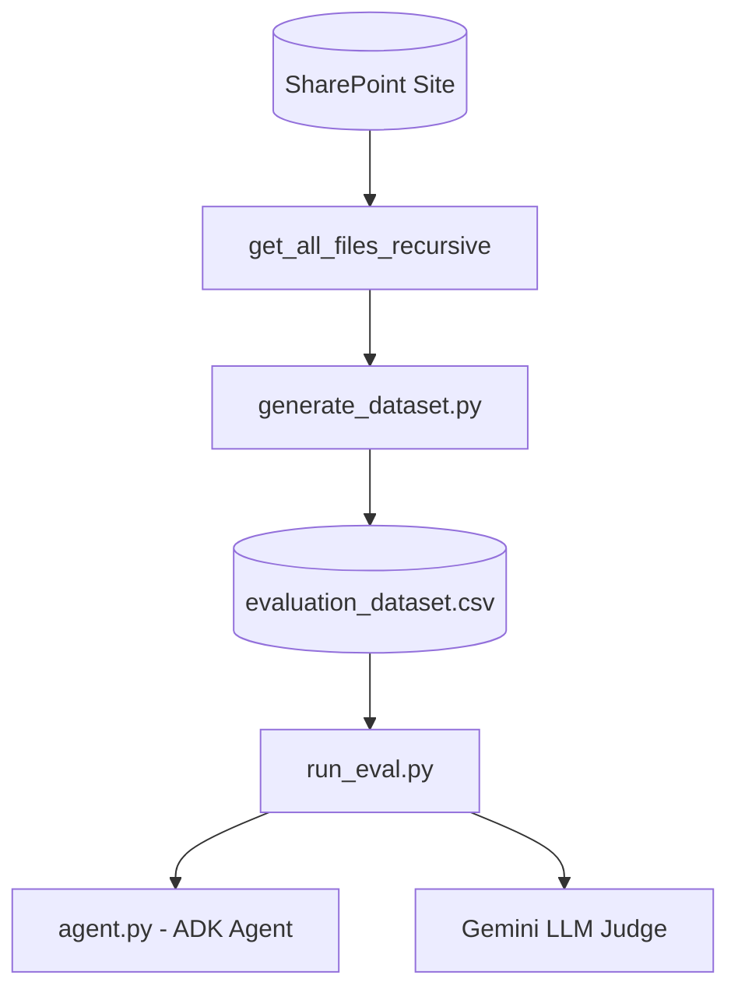

# 🧪 SharePoint Agent Evaluation Harness

The evaluation harness allows you to execute robust regression testing on the SharePoint File Agent. It scores whether the agent correctly answers user queries and selects the most efficient tool trajectory across persistent conversational turns.

---

## 🏗️ System Flow



---

## 📁 Components

### 1. Dataset Generator (`generate_dataset.py`)
Traverses your SharePoint document library recursively and automatically synthesizes a **100-row golden benchmark dataset** (`evaluation_dataset.csv`):
*   **RMS-Protected Files**: Identifies encrypted Purview items (Confidential/Highly Confidential). It generates a generic query (*"Summarize the contents of..."*) and maps the expected response to the standard Purview decryption error block.
*   **Unencrypted Files**: Downloads and extracts text from readable Word, PDF, PowerPoint, and text files. It then uses Gemini to synthesize a **highly specific, natural question** and a **precise factual answer** based on the document.
*   **Schema**: Mapped as `query`, `expected_response`, `expected_tool_trajectory`, `source`, `file_type`, `sensitivity_label`, and `is_encrypted`.

### 2. Evaluation Runner (`run_eval.py`)
Reads the benchmark CSV, executes the queries sequentially on the ADK Runner in persistent sessions, and scores the outcomes:
*   **Trajectory Logging**: Hooks into `agent.py` using a module-level list `_tool_calls_log` to record the exact sequence of tool calls and parameters the agent actually executed.
*   **Semantic Correctness (LLM-as-a-Judge)**: Uses Gemini to evaluate the semantic correctness of the agent's response against the benchmark's expected response, ignoring minor wording or greeting differences.
*   **Trajectory Scoring**: Computes trajectory match rates by comparing actual executed tool calls against expected benchmark trajectories.
*   **Detailed Output**: Generates a detailed JSON run summary (`evaluation_results.json`), a complete case-by-case trace report (`evaluation_report.md`), and a deep analytical insights report (`evaluation_insights.md`) summarizing the exact operational capabilities and dataset optimizations.

---

## 🤖 ADK Agent Integration

This evaluation harness serves as an automated quality assurance and regression pipeline specifically auditing your ADK agent's performance:
*   **`generate_dataset.py`**: **Does NOT** use the ADK agent. It walks your SharePoint site directly using core Graph REST API clients (`sharepoint_client.py`) and queries raw Gemini API models (`google.genai.Client`) to synthesize test scenarios.
*   **`run_eval.py`**: **YES (Active Agent Testing)**. It imports the ADK agent (`root_agent` from `agent.py`) and actively executes sequential user query prompts directly inside persistent agent conversational runs (`root_agent.run_async()`). It tests:
    1.  **Tool Trajectory Accuracy**: Validates if the agent correctly selects `search_sharepoint_files` followed by `read_sharepoint_file` or `list_file_permissions` to solve prompts.
    2.  **Answering Correctness**: Measures if the agent successfully presents the clickable links, file sizes, and Purview sensitivity indicators in the Markdown table format specified in its system instructions.
    3.  **Context Size & Footprint Costs**: Records the precise token cost of each run, verifying that our file reader's semantic chunking successfully minimizes LLM token usage.

---

## 🚀 Execution Guide

Ensure your virtual environment is active:
```bash
source .venv/bin/activate
```

### A. Generating the Golden Dataset
To recursively scan SharePoint and generate the 100-row golden Q&A CSV:
```bash
python harness/generate_dataset.py
```
*   *Output CSV*: `harness/evaluation_dataset.csv`

### B. Running the Evaluation Runner
To evaluate the agent's accuracy and trajectories (defaults to the first 5 test cases for efficiency, pass an integer to override):
```bash
# Run first 5 test cases
python harness/run_eval.py 5

# Run full 100-row evaluation
python harness/run_eval.py 100
```
*   *Output Report*: `harness/evaluation_report.md`
*   *Raw JSON Metrics*: `harness/evaluation_results.json`
