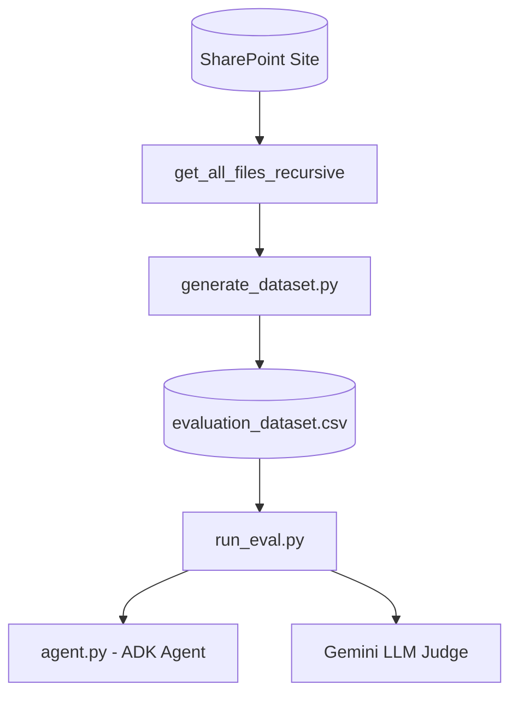

# 🧪 SharePoint Agent Evaluation Harness

The evaluation harness allows you to execute robust regression testing on the SharePoint File Agent. It scores whether the agent correctly answers user queries and selects the most efficient tool trajectory across persistent conversational turns.

---

## 🏗️ System Flow



---

## 📁 Components

### 1. Dataset Generator (`generate_dataset.py`)
Traverses your SharePoint document library recursively and automatically synthesizes a **100-row golden benchmark dataset** (`evaluation_dataset.csv`):
*   **RMS-Protected Files**: Identifies encrypted Purview items (Confidential/Highly Confidential). It generates a generic query (*"Summarize the contents of..."*) and maps the expected response to the standard Purview decryption error block.
*   **Unencrypted Files**: Downloads and extracts text from readable Word, PDF, PowerPoint, and text files. It then uses Gemini to synthesize a **highly specific, natural question** and a **precise factual answer** based on the document.
*   **Schema**: Mapped as `query`, `expected_response`, `expected_tool_trajectory`, `source`, `file_type`, `sensitivity_label`, and `is_encrypted`.

### 2. Evaluation Runner (`run_eval.py`)
Reads the benchmark CSV, executes the queries sequentially on the ADK Runner in persistent sessions, and scores the outcomes:
*   **Trajectory Logging**: Hooks into `agent.py` using a module-level list `_tool_calls_log` to record the exact sequence of tool calls and parameters the agent actually executed.
*   **Semantic Correctness (LLM-as-a-Judge)**: Uses Gemini to evaluate the semantic correctness of the agent's response against the benchmark's expected response, ignoring minor wording or greeting differences.
*   **Trajectory Scoring**: Computes trajectory match rates by comparing actual executed tool calls against expected benchmark trajectories.
*   **Detailed Output**: Generates a detailed JSON run summary (`evaluation_results.json`), a complete case-by-case trace report (`evaluation_report.md`), and a deep analytical insights report (`evaluation_insights.md`) summarizing the exact operational capabilities and dataset optimizations.

---

## 🤖 ADK Agent Integration

This evaluation harness serves as an automated quality assurance and regression pipeline specifically auditing your ADK agent's performance:
*   **`generate_dataset.py`**: **Does NOT** use the ADK agent. It walks your SharePoint site directly using core Graph REST API clients (`sharepoint_client.py`) and queries raw Gemini API models (`google.genai.Client`) to synthesize test scenarios.
*   **`run_eval.py`**: **YES (Active Agent Testing)**. It imports the ADK agent (`root_agent` from `agent.py`) and actively executes sequential user query prompts directly inside persistent agent conversational runs (`root_agent.run_async()`). It tests:
    1.  **Tool Trajectory Accuracy**: Validates if the agent correctly selects `search_sharepoint_files` followed by `read_sharepoint_file` or `list_file_permissions` to solve prompts.
    2.  **Answering Correctness**: Measures if the agent successfully presents the clickable links, file sizes, and Purview sensitivity indicators in the Markdown table format specified in its system instructions.
    3.  **Context Size & Footprint Costs**: Records the precise token cost of each run, verifying that our file reader's semantic chunking successfully minimizes LLM token usage.

---

## 🚀 Execution Guide

Ensure your virtual environment is active:
```bash
source .venv/bin/activate
```

### A. Generating the Golden Dataset
To recursively scan SharePoint and generate the 100-row golden Q&A CSV:
```bash
python harness/generate_dataset.py
```
*   *Output CSV*: `harness/evaluation_dataset.csv`

### B. Running the Evaluation Runner
To evaluate the agent's accuracy and trajectories (defaults to the first 5 test cases for efficiency, pass an integer to override):
```bash
# Run first 5 test cases
python harness/run_eval.py 5

# Run full 100-row evaluation
python harness/run_eval.py 100
```
*   *Output Report*: [evaluation_report.md](file:///Users/weizhongt/coding/agentic-demos/sharepoint_eval/harness/evaluation_report.md)
*   *Deep Analytical Insights*: [evaluation_insights.md](file:///Users/weizhongt/coding/agentic-demos/sharepoint_eval/harness/evaluation_insights.md)
*   *Raw JSON Metrics*: [evaluation_results.json](file:///Users/weizhongt/coding/agentic-demos/sharepoint_eval/harness/evaluation_results.json)

---

> [!TIP]
> ### 📊 Analyzing Evaluation Metrics
> After executing a full 100-row evaluation run, refer directly to **[evaluation_insights.md](file:///Users/weizhongt/coding/agentic-demos/sharepoint_eval/harness/evaluation_insights.md)**. 
> 
> This curated analytics report collates key performance indicators including **Semantic Accuracy (LLM Judge)**, **Tool Trajectory Match Rate**, and **Average Query Latency**, giving PMs and field teams immediate data-backed proof of connector agent efficiency and cost optimizations.

---

## 💡 General Tips for SharePoint Query & Evaluation Design

When designing conversational queries, constructing benchmark datasets, or evaluating agent trajectories against SharePoint repositories, follow these general best practices to balance LLM correctness, trajectory efficiency, and programmatic validation:

### 1. Avoid Ambient Query Ambiguity (Conversational Disambiguation)
*   **The Challenge**: Prompts that ask *"according to the document"* or *"in the file"* without explicit keywords are highly ambiguous. Rather than guessing or hallucinating, a high-quality, secure conversational agent will (and should) ask the user for clarification (e.g., *"Which document are you referring to?"*).
*   **The Tip**: When generating "golden" benchmark datasets, ensure queries contain clear filename keywords or distinct identifiers (e.g. *"In the GovText Guide, what is the primary focus...?"*). In testing engines, recognize that conversational disambiguation is a sign of robust conversational intelligence, not a trajectory failure.

### 2. Embrace Search Metadata Short-cutting (Trajectory Efficiency)
*   **The Challenge**: When a query asks about file properties (e.g., *"When was the policy last updated?"* or *"Who is the author of the roadmap?"*), an efficient agent should parse the SharePoint search results header directly. It should NOT download and parse the complete file payload.
*   **The Tip**: Avoid programmatically penalizing the agent for using a single `[search_sharepoint_files]` tool call instead of the expected `[search -> read]` sequence. Design testing evaluations to reward short-cutting when the answer is successfully resolved purely via metadata search headers, saving significant latency and token costs.

### 3. Isolate Ingestion Formats & Purview RMS Controls
*   **The Challenge**: Standard office documents (`.docx`, `.xlsx`, `.pdf`) can be parsed directly, but encrypted Purview Information Protection (RMS) wrappers cannot be read by external utilities.
*   **The Tip**: Ensure the connector client queries sensitivity classifications at the metadata stage *before* running a binary download. Implement automated flows that route encrypted items directly to polite user-notification states (explaining Purview decryption boundaries) instead of attempting programmatic parsing that triggers parsing exceptions.

