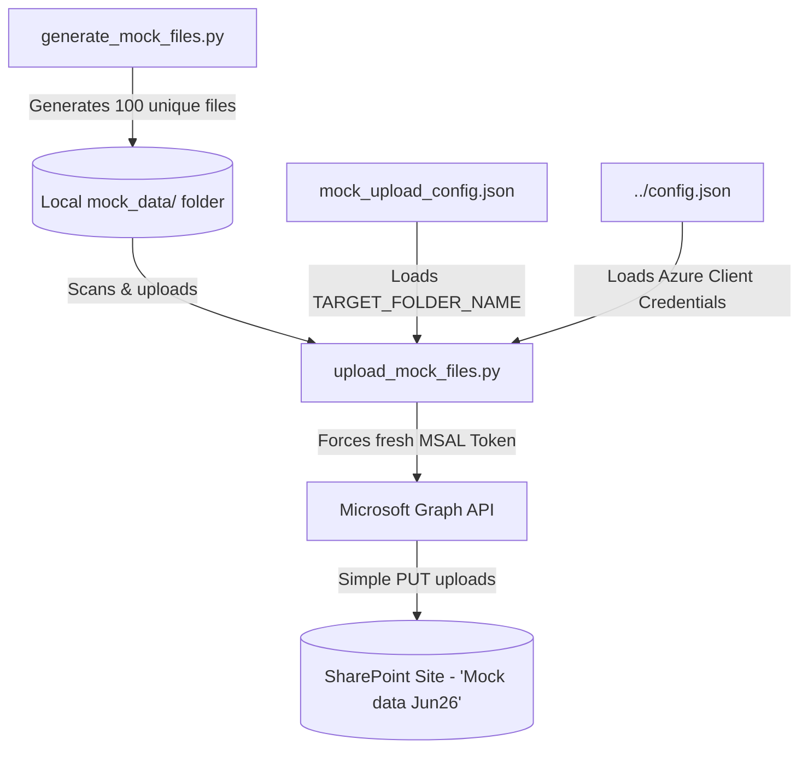

# 📂 Mock Corporate Banking Dataset & SharePoint Uploader

The `mock_data` folder creates realistic corporate banking files and uploads them to your SharePoint site. This gives you a set of test files to check search accuracy and agent tools.

---

## 🏗️ System Flow



---

## 📁 Components

### 1. Banking Data Generator (`generate_mock_files.py`)
Creates **100 unique files** (25 of each type: `.docx`, `.pptx`, `.xlsx`, `.pdf`) across 10 banking topics:
*   **Risk Management**: Credit risk frameworks, liquidity coverage ratio (LCR) audits, market stress testing, and climate risk guidelines.
*   **Compliance & Auditing**: AML SOPs, KYC plans, insider trading rules, and whistleblowing guidelines.
*   **Asset & Wealth Management**: Portfolio strategies, discretionary mandates, estate planning, and tax guides.
*   **Technology & Operations**: Core banking cloud migrations, SWIFT ISO standards, payment SOPs, and ATM security.
*   **Human Resources (HR)**: Hybrid work guidelines, offboarding rules, parental leave policies, and wellness programs.
*   **Procurement & Vendor Management**: Vendor code of conduct, RFPs, software licenses, and contracts.
*   **Learning & Development (L&D)**: Compliance courses, graduate training, and leadership programs.
*   **Expense Policy & Finance**: Travel rules, CAPEX approvals, and accounts payable SOPs.
*   **Promotions & Talent Management**: 360 performance reviews, engineering career paths, and succession guides.
*   **IT Support & Cybersecurity**: Password rules, DLP rules, BYOD guides, and security response plans.

Files use clear names (e.g., `Anti_Money_Laundering_AML_Standard_Operating_Procedures_v1.docx`) and have realistic layouts with tables and bullet points.

### 2. Folder Settings (`mock_upload_config.json.example`)
Settings template to name the target SharePoint folder:
```json
{
  "TARGET_FOLDER_NAME": "YOUR_TARGET_SHAREPOINT_FOLDER_NAME"
}
```
*Note: Copy `mock_upload_config.json.example` to `mock_upload_config.json` and write your folder name. This file is ignored by Git to keep secrets safe.*

### 3. Fresh-Token Upload Engine (`upload_mock_files.py`)
Handles folder checks and file uploads:
*   **Get Fresh Token**: Forces the app to get a new token with write access.
*   **Check Folder**: Verifies that the target folder exists in SharePoint.
*   **Upload Files**: Uses Microsoft Graph PUT calls to upload files under 4MB.

---

## 🤖 ADK Agent Integration

*   **`generate_mock_files.py` & `upload_mock_files.py`**: **Do NOT** use the ADK Agent. They are offline helper scripts to create and upload test files directly.

---

## 🔐 Azure AD Consent & Permissions Requirements

The Azure App Registration needs write access to upload files:

1.  Open the **Microsoft Entra admin center** > **App registrations** > Select your app.
2.  Go to **API permissions** > **Add a permission** > **Microsoft Graph** > **Application permissions**.
3.  Search for and add:
    *   `Sites.ReadWrite.All` (Lets the app write files to SharePoint).
4.  **IMPORTANT**: Click **Grant admin consent for [Your Tenant]** to apply the changes.

---

## 🚀 Execution Guide

Make sure your virtual environment is active:
```bash
source .venv/bin/activate
```

### 1. Generate the Mock Files
The mock files are already generated and saved in `/mock_data/`. To recreate them:
```bash
python mock_data/generate_mock_files.py
```

### 2. Upload the Files to SharePoint
Make sure the target folder exists in SharePoint, and then run the upload script:
```bash
python mock_data/upload_mock_files.py
```

*The script will output the upload status, ending with `Successfully Uploaded: 100`.*
