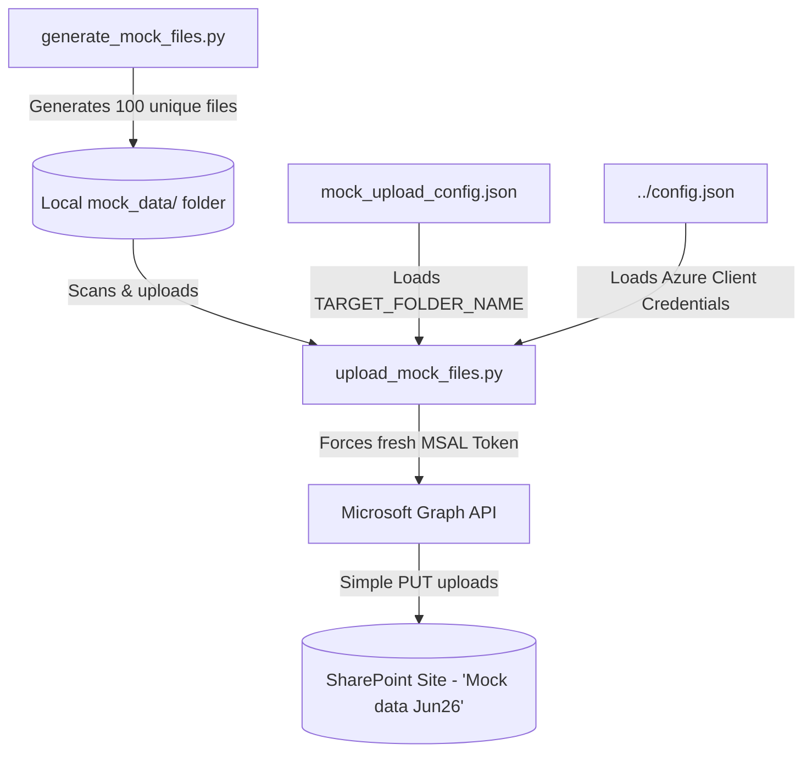

# 📂 Mock Corporate Banking Dataset & SharePoint Uploader

The `mock_data` module is a self-contained utility designed to generate a realistic corporate banking corpus and upload it to a target SharePoint Document Library folder. This provides a high-fidelity set of test documents covering common financial and horizontal business domains (Risk, compliance, ESG, Ops, Wealth, HR, Procurement, Learning & Development, Expense Policy, promotions/talent, and Cybersecurity/IT support) to evaluate search accuracy, classification engines, and semantic audits.

---

## 🏗️ System Flow



---

## 📁 Components

### 1. High-Fidelity Bank Data Generator (`generate_mock_files.py`)
Generates **100 completely unique files** distributed evenly (25 of each type: `.docx`, `.pptx`, `.xlsx`, `.pdf`) across 10 core and horizontal financial business domains (10 unique topics per domain):
*   **Risk Management**: Credit risk frameworks, liquidity coverage ratio (LCR) audits, market stress testing, operational risk incidents logs, and climate risk assessments.
*   **Compliance & Auditing**: AML SOPs, sanctions screening rules, KYC remediation plans, insider trading prevention codes, and whistleblowing protocols.
*   **Asset & Wealth Management**: HNWI portfolio strategies, discretionary mandates, estate planning, ESG screens, and tax minimization setups.
*   **Technology & Operations**: Core banking cloud migrations, SWIFT ISO 20022 standards, gateway payment SOPs, and physical ATM/cash vault security.
*   **Human Resources (HR)**: Hybrid work guidelines, offboarding exit policies, parental leave standards, and workplace health programs.
*   **Procurement & Vendor Management**: Vendor code of conduct, commercial RFP weighting criteria, software license frameworks, and service agreements.
*   **Learning & Development (L&D)**: Compliance certifications, graduate training paths, leadership programs, and customer empathy modules.
*   **Expense Policy & Finance**: Travel regulations, CAPEX approvals, accounts payable matching models, and asset write-off rules.
*   **Promotions & Talent Management**: 360 performance feedback structures, technical pathing reviews, and succession planning guides.
*   **IT Support & Cybersecurity**: User MFA standards, DLP monitoring protocols, BYOD regulations, and incident containment procedures.

Each file utilizes content-aware naming conventions (e.g., `Anti_Money_Laundering_AML_Standard_Operating_Procedures_v1.docx`) and includes realistic document formats with tables, metadata headers, bullet points, and slide outlines to simulate authentic files.

### 2. SharePoint Directory Configuration (`mock_upload_config.json.example`)
A template file is provided to configure the target SharePoint destination directory:
```json
{
  "TARGET_FOLDER_NAME": "YOUR_TARGET_SHAREPOINT_FOLDER_NAME"
}
```
*Note: The actual `mock_upload_config.json` is ignored by Git to prevent environment pollution. Copy `mock_upload_config.json.example` to `mock_upload_config.json` and fill in your specific target directory name. This file references the root `config.json` for credentials to ensure zero security overlap.*

### 3. Fresh-Token Upload Engine (`upload_mock_files.py`)
Performs robust directory checking and files ingestion:
*   **Fresh Token Acquisition**: MSAL caches access tokens locally. When permissions are newly granted in Azure AD, silent token calls return cached read-only privileges. This uploader explicitly calls `app.acquire_token_for_client()` to fetch an updated write-scoped token.
*   **Directory Verification**: Verifies that the user has manually pre-created the target SharePoint folder (`Mock data Jun26`) inside the default drive library to accommodate restrictive site role scopes.
*   **Put Upload Integration**: Implements MS Graph simple PUT item uploads for files under the 4MB threshold.

---

## 🤖 ADK Agent Integration

*   **`generate_mock_files.py` & `upload_mock_files.py`**: **Do NOT** use the ADK Agent. They operate purely as offline utility scripts to prepare and ingest representative data corpus, executing local document formatting and Microsoft Graph REST PUT payloads directly.

---

## 🔐 Azure AD Consent & Permissions Requirements

To perform uploads, the Application registration configured in your root `config.json` must have write-scoped directory roles:

1.  Navigate to the **Microsoft Entra admin center** > **App registrations** > Select your app.
2.  Go to **API permissions** > **Add a permission** > **Microsoft Graph** > **Application permissions**.
3.  Search for and add:
    *   `Sites.ReadWrite.All` (Allows writing files to SharePoint document libraries).
4.  **CRITICAL**: Click **Grant admin consent for [Your Tenant]** to authorize the updated scope.

---

## 🚀 Execution Guide

Ensure your virtual environment is active and packages are installed:
```bash
source .venv/bin/activate
```

### 1. (Optional) Re-generate the Mock Dataset
The mock dataset is already generated and populated inside `/mock_data/`. If you want to recreate or clean the dataset, run:
```bash
python mock_data/generate_mock_files.py
```

### 2. Upload the Dataset to SharePoint
Ensure the target folder specified in `mock_upload_config.json` exists in your SharePoint site, and then execute the upload script:
```bash
python mock_data/upload_mock_files.py
```

*Upon successful completion, the engine outputs the total upload status reporting `Successfully Uploaded: 100`.*
