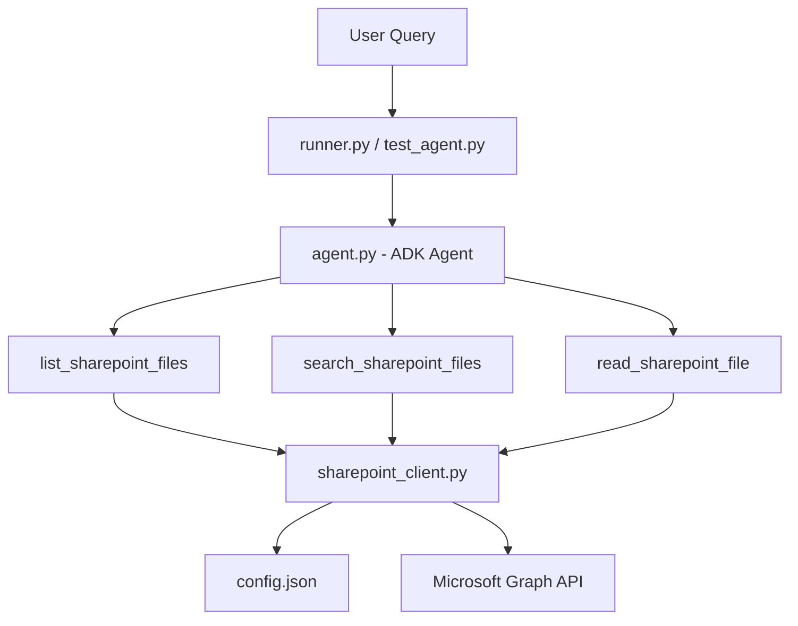

# SharePoint File Agent Walkthrough

This guide provides a comprehensive walkthrough for setting up, running, and understanding the Google Agent Development Kit (ADK) SharePoint File Agent. This agent is capable of listing files, performing region-routed searches, displaying Purview sensitivity labels, and extracting document contents.

---

## 🏗️ Architecture Overview

The system consists of the following components:



1. **`config.json`**: Centralized configuration storing SharePoint credentials, site path, Vertex AI model name, and region specs.
2. **`sharepoint_client.py`**: Core integration engine executing Microsoft Graph REST queries, parsing `.docx` files, and implementing the two-step search-and-fetch pipeline.
3. **`agent.py`**: Main ADK Agent configuration registering all three tools and enforcing strict Markdown, emoji, and tabular formatting instructions.
4. **`runner.py`**: Interactive CLI chat and one-shot query CLI runner.
5. **`test_agent.py`**: Programmatic persistent session simulator.
6. **`test_docx.py` / `test_pdf.py` / `test_pptx.py` / `test_xlsx.py`**: Specialized file type test scripts performing targeted metadata searching, content parsing, and insight-driven analytical queries.

---

## 🔐 Step 1: Azure AD App Registration & Permissions

To interact with SharePoint, the agent authenticates using the **Microsoft Graph API** under an Application Identity.

1. **Log in to Azure Portal**: Sign in to the [Azure Portal](https://portal.azure.com/).
2. **App Registrations**: Search for **Microsoft Entra ID**, go to **App registrations** > **New registration**.
   - **Name**: E.g., `SharePoint File Agent`
   - **Supported account types**: Choose *Accounts in this organizational directory only* (Single Tenant).
   - Click **Register**.
3. **Collect IDs**: Copy the **Application (client) ID** and **Directory (tenant) ID** from the Overview tab.
4. **Create a Client Secret**:
   - Go to **Certificates & secrets** > **Client secrets** > **New client secret**.
   - Add a description and expiration, then click **Add**.
   - **CRITICAL**: Copy the secret **Value** immediately. It will be hidden forever once you navigate away.
5. **Configure API Permissions**:
   - Go to **API permissions** > **Add a permission** > **Microsoft Graph** > **Application permissions**.
   - Search for and add:
     - `Sites.Read.All` (to find SharePoint site IDs)
     - `Files.Read.All` (to list/search files and download contents across drives)
6. **Grant Admin Consent**:
   - Click **Grant admin consent for [Your Tenant]** and confirm with **Yes**.

---

## ⚙️ Step 2: Configuration

Create or edit the `config.json` file in the project root directory:

```json
{
  "TENANT_ID": "YOUR_TENANT_ID_HERE",
  "CLIENT_ID": "YOUR_CLIENT_ID_HERE",
  "CLIENT_SECRET": "YOUR_CLIENT_SECRET_HERE",
  "SHAREPOINT_SITE_HOST": "yourcompany.sharepoint.com",
  "SHAREPOINT_SITE_PATH": "/sites/your-site-name",
  "MODEL_NAME": "gemini-2.5-flash",
  "GCP_PROJECT_ID": "your-gcp-project-id",
  "GCP_LOCATION": "us-central1"
}
```

---

## 🚀 Step 3: Running and Testing the Agent

Activate the pre-configured Python virtual environment:
```bash
source .venv/bin/activate
```

### Authenticate with Google Cloud Vertex AI
If the agent uses Google Cloud Vertex AI for Gemini LLM processing, authenticate using Application Default Credentials:
```bash
gcloud auth application-default login
```

### Option A: Interactive CLI Mode
Start an interactive CLI chat session:
```bash
python runner.py
```

### Option B: Automated Conversational Verification
You can execute the automated persistent session test scripts to verify specific file type search, extraction, and reasoning capabilities:

*   **Test Word (`.docx`)**: Resolves names, reads text, and answers target questions:
    ```bash
    python test_docx.py
    ```
*   **Test PDF (`.pdf`)**: Downloads, extracts page-by-page text, and summarizes:
    ```bash
    python test_pdf.py
    ```
*   **Test PowerPoint (`.pptx`)**: Reads slide-by-slide layout and extracts contents:
    ```bash
    python test_pptx.py
    ```
*   **Test Excel (`.xlsx`)**: Downloads cell grids and performs complex analytical data reasoning (e.g., comparing weekend vs. weekday infection trends):
    ```bash
    python test_xlsx.py
    ```

---

## 💡 Technical Under the Hood: How It Works

### 1. Two-Step Search & Fetch Pipeline
*   **The Problem**: Standard Microsoft Graph `search(q='...')` calls on application drives fail with `403 Access Denied` in many tenant configurations. Furthermore, search endpoints do not return Purview sensitivity labels.
*   **The Solution**: The agent performs search in two steps:
    1.  **Step 1 (Find)**: Queries the modern `POST /v1.0/search/query` endpoint specifying `"region": "APC"` to fetch the matching item ID and parent drive ID instantly.
    2.  **Step 2 (Fetch)**: Executes a direct, high-speed `GET /beta/drives/{drive_id}/items/{item_id}` query containing `$select=...,sensitivityLabel` to fetch complete metadata including sensitivity labels.

### 2. Purview Sensitivity & Emojis
The agent identifies Purview Sensitivity classifications from file properties and presents them with color-coded indicators:
*   🟢 `General \ All Employees (unrestricted)`
*   🟡 `Confidential \ All Employees`
*   🔴 `Highly Confidential \ All Employees`

### 3. RMS Encryption Constraints
*   **RMS-Protected Files (e.g. `test1.docx`, `test3.pptx`, `some_protected_file.xlsx`)**: Files labeled as *Confidential* or *Highly Confidential* are encrypted using Microsoft Rights Management Services (RMS/MIP). When downloaded via the API, the binary payload is an encrypted compound envelope. Parsing it via standard zip packages will fail with a `File is not a zip file` exception.
*   **Unrestricted Files (e.g. `test2.docx`, `Corporate transactions.pptx`, `7-day Moving Average Daily Estimated Numbers of COVID-19 Infections.xlsx`)**: Files with standard labels are not encrypted. The agent extracts their clean text paragraphs (for `.docx`), slides (for `.pptx`), or cell data grids (for `.xlsx`) instantly and outputs them for summarization without requiring any extra python library dependencies.
