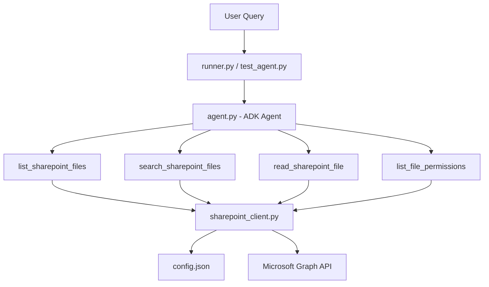

# SharePoint File Agent Walkthrough

This guide shows you how to set up, run, and understand the Google Agent Development Kit (ADK) SharePoint File Agent. This agent lets you list files, search them across regions, see Purview sensitivity labels, and read document contents.

---

## 🏗️ Architecture Overview

Here is how the system components work together:



1. **`config.json`**: Settings file to store SharePoint credentials, site path, model name, and region.
2. **`deploy_ge_ae/.env`**: Environment file to store credentials for cloud deployment.
3. **`sharepoint_client.py`**: Core helper to run Graph API calls, parse files, and run search and permission audits.
4. **`agent.py`**: Main agent setup that registers the four tools and sets formatting rules (tables, emojis, Markdown).
5. **`runner.py`**: Interactive chat client.
6. **`agent_tests/`**: Scripts to test Word, PDF, PowerPoint, and Excel file search and content extraction.
7. **`agent_tests/test_permissions_agent.py`**: Test script to check direct file permissions.
8. **`stats/collate_stats.py`**: Script to scan SharePoint and write file size and label statistics to a markdown report.
9. **`analyse_conflict/detect_conflicts.py`**: Script to find facts in documents and use Gemini to check for policy conflicts.
10. **`harness/generate_dataset.py`**: Script to scan SharePoint and generate a test Q&A dataset spreadsheet.
11. **`harness/run_eval.py`**: Runner to execute agent tests and grade them using Gemini.

---

## 🔐 Step 1: Azure AD App Registration & Permissions

The agent needs to authenticate with **Microsoft Graph API** to read SharePoint files.

1. **Log in to Azure**: Open the [Azure Portal](https://portal.azure.com/).
2. **Register App**: Search for **Microsoft Entra ID**, go to **App registrations** > **New registration**.
   - **Name**: E.g., `SharePoint File Agent`
   - **Supported account types**: Choose *Accounts in this organizational directory only* (Single Tenant).
   - Click **Register**.
3. **Save IDs**: Copy the **Application (client) ID** and **Directory (tenant) ID** from the Overview tab.
4. **Create a Client Secret**:
   - Go to **Certificates & secrets** > **Client secrets** > **New client secret**.
   - Add a description, choose when it expires, and click **Add**.
   - **IMPORTANT**: Copy the secret **Value** right away. It will be hidden forever once you leave the page.
5. **Set API Permissions**:
   - Go to **API permissions** > **Add a permission** > **Microsoft Graph** > **Application permissions**.
   - Search for and add these permissions:
     - `Sites.Read.All` (to find site IDs)
     - `Files.Read.All` (to search files and download contents)
6. **Grant Admin Consent**:
   - Click **Grant admin consent for [Your Tenant]** and click **Yes** to confirm.

---

## ⚙️ Step 2: Configuration

Copy the `config.json.example` file to create a new file named `config.json` in your project root. Add your credentials:

```json
{
  "TENANT_ID": "YOUR_TENANT_ID_HERE",
  "CLIENT_ID": "YOUR_CLIENT_ID_HERE",
  "CLIENT_SECRET": "YOUR_CLIENT_SECRET_HERE",
  "SHAREPOINT_SITE_HOST": "yourcompany.sharepoint.com",
  "SHAREPOINT_SITE_PATH": "/sites/your-site-name",
  "MODEL_NAME": "gemini-2.5-flash",
  "GCP_PROJECT_ID": "your-gcp-project-id",
  "GCP_LOCATION": "us-central1"
}
```

---

## 🚀 Step 3: Running and Testing the Agent

Activate your Python virtual environment:
```bash
source .venv/bin/activate
```

### Log In to Google Cloud Vertex AI
If the agent uses Vertex AI for Gemini LLM, log in with Application Default Credentials:
```bash
gcloud auth application-default login
```

### Option A: Interactive CLI Mode
Start an interactive chat session:
```bash
python runner.py
```

### Option B: Run Automated Tests
You can run automated tests in the `agent_tests/` folder to check file search and read tools:

*   **Test Word (`.docx`)**: Find files, read text, and answer questions:
    ```bash
    python agent_tests/test_docx.py
    ```
*   **Test PDF (`.pdf`)**: Download files, extract page text, and summarize:
    ```bash
    python agent_tests/test_pdf.py
    ```
*   **Test PowerPoint (`.pptx`)**: Read slides and extract text:
    ```bash
    python agent_tests/test_pptx.py
    ```
*   **Test Excel (`.xlsx`)**: Download spreadsheets and perform calculations:
    ```bash
    python agent_tests/test_xlsx.py
    ```

### Option C: Run the Test Harness
To run regression tests across a large set of documents:

1.  **Generate Test Dataset**: Scan SharePoint and create a Q&A spreadsheet:
    ```bash
    python harness/generate_dataset.py
    ```
    *Output Dataset*: `harness/evaluation_dataset.csv`
2.  **Run Evaluation**: Run tests and grade agent accuracy, speed, and token cost using Gemini:
    ```bash
    python harness/run_eval.py
    ```
    *Markdown Report*: `harness/evaluation_report.md`
    *Insights Report*: `harness/evaluation_insights.md`

---

## 💡 Technical Details: How It Works

### 1. Two-Step Search Pipeline
*   **The Problem**: Standard Microsoft Graph search calls often fail with `403 Access Denied` under single-app configs. Plus, search APIs do not return Purview sensitivity labels.
*   **The Solution**: The agent searches in two steps:
    1.  **Step 1 (Find)**: Queries the Microsoft Graph search endpoint specifying `"region": "APC"` to find the matching file ID and drive ID.
    2.  **Step 2 (Fetch)**: Makes a direct call to `/beta/drives/{drive_id}/items/{item_id}` to get sensitivity labels.

### 2. Purview Sensitivity Emojis
The agent reads sensitivity labels and shows them with status emojis:
*   🟢 `General \ All Employees (unrestricted)`
*   🟡 `Confidential \ All Employees`
*   🔴 `Highly Confidential \ All Employees`

### 3. RMS Encryption Checks
*   **Encrypted Files**: Files labeled *Confidential* or *Highly Confidential* are locked with Microsoft Rights Management Services (RMS). The downloaded file is an encrypted envelope. Reading it as a standard ZIP package will crash with a `File is not a zip file` error.
*   **Unrestricted Files**: Standard files are not encrypted and can be read easily.

### 4. Fast Subprocess Parsing & Smart Chunking
The reading pipeline uses two smart features to save tokens and run quickly:
*   **Subprocess OS Parsing**:
    When downloading a file, the agent checks the host system for fast command-line tools. If found, it runs them in a lightweight subprocess:
    *   **PDFs**: Spawns `pdftotext <temp_file> -` (very fast, uses low memory).
    *   **Word (`.docx`)**: Spawns `docx2txt <temp_file>`.
    *   **Media (`.png`, `.jpg`, etc.)**: Spawns `exiftool` to read image/audio headers.
    *   *Fallback*: If these tools are missing, it uses Python libraries to read files.
*   **Smart Semantic Chunker**:
    When you read a file, you can provide a search query (e.g., `query="LCR ratio"`). The client:
    1.  Splits the text into overlapping semantic paragraphs.
    2.  Ranks them by keyword match and phrase match.
    3.  Returns **only the top 3 most relevant chunks** with clean borders.
    4.  **Token Savings**: Cuts token size and LLM costs by **95%+** and prevents context window limits.

### 5. Dual-Environment Settings
The client checks credentials dynamically based on the environment:
1.  **Local (Fallback)**: Loads settings from `config.json` in your project root.
2.  **Cloud Container (Primary)**: If running inside Vertex AI Agent Engine, it reads credentials directly from environment variables. `config.json` is ignored to keep your secrets out of staged cloud container uploads.
