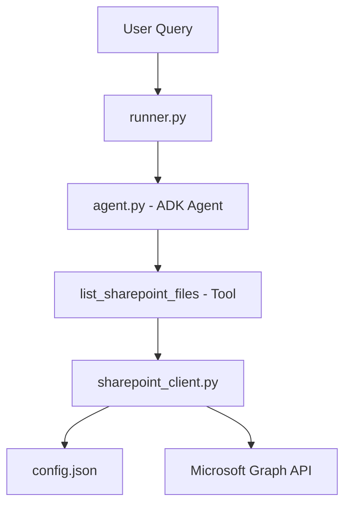

# SharePoint File Lister ADK Agent Walkthrough

This guide provides a comprehensive walkthrough for setting up and running a Google Agent Development Kit (ADK) agent that can list and browse all files in a given Microsoft SharePoint site.

---

## 🏗️ Architecture Overview

The system consists of four main components:



1. **`config.json`**: Centralized configuration storing SharePoint host/path information, model selection, and Azure Active Directory credentials.
2. **`sharepoint_client.py`**: High-level client wrapper that uses `msal` for OAuth2 authentication and requests to interact with Microsoft Graph API.
3. **`agent.py`**: The ADK Agent definition specifying the model, instructions, and tool registrations.
4. **`runner.py`**: An interactive CLI shell and one-shot query runner.

---

## 🔐 Step 1: Azure AD App Registration & Permissions

To list files in SharePoint, the agent needs to authenticate as an application using the **Microsoft Graph API**.

Follow these steps to create an Azure AD App Registration and grant the necessary permissions:

1. **Log in to Azure Portal**: Go to the [Azure Portal](https://portal.azure.com/) and sign in.
2. **App Registrations**: Search for and select **Microsoft Entra ID** (formerly Azure Active Directory), then go to **App registrations** > **New registration**.
   - **Name**: E.g., `SharePoint File Lister Agent`
   - **Supported account types**: Choose *Accounts in this organizational directory only* (Single Tenant).
   - Click **Register**.
3. **Collect IDs**: Copy the following fields from the Overview tab:
   - **Application (client) ID**
   - **Directory (tenant) ID**
4. **Create a Client Secret**:
   - Go to **Certificates & secrets** > **Client secrets** > **New client secret**.
   - Add a description and expiration time, then click **Add**.
   - **CRITICAL**: Copy the secret **Value** immediately. You won't be able to see it again after you leave this page.
5. **Configure API Permissions**:
   - Go to **API permissions** > **Add a permission**.
   - Select **Microsoft Graph**.
   - Choose **Application permissions**.
   - Search for and select the following permissions:
     - `Sites.Read.All` (allows the agent to find SharePoint site IDs)
     - `Files.Read.All` (allows the agent to list documents and files across all drives)
   - Click **Add permissions**.
6. **Grant Admin Consent**:
   - On the API permissions page, click **Grant admin consent for [Your Tenant Name]** and click **Yes** to confirm. (This is required for Application permissions).

---

## ⚙️ Step 2: Configure the Agent

Edit the `config.json` file located in the project root directory:

```json
{
  "TENANT_ID": "YOUR_TENANT_ID_HERE",
  "CLIENT_ID": "YOUR_CLIENT_ID_HERE",
  "CLIENT_SECRET": "YOUR_CLIENT_SECRET_HERE",
  "SHAREPOINT_SITE_HOST": "yourcompany.sharepoint.com",
  "SHAREPOINT_SITE_PATH": "/sites/your-site-name",
  "MODEL_NAME": "gemini-2.5-flash"
}
```

### Configuration Details:
- `TENANT_ID`, `CLIENT_ID`, `CLIENT_SECRET`: Gathered from Step 1.
- `SHAREPOINT_SITE_HOST`: The main SharePoint host for your organization (e.g. `mycorp.sharepoint.com`).
- `SHAREPOINT_SITE_PATH`: The relative path to your specific site. For example, if the site URL is `https://mycorp.sharepoint.com/sites/Engineering`, the path is `/sites/Engineering`.
- `MODEL_NAME`: The Gemini model used by ADK. Defaults to `gemini-2.5-flash`.

---

## 🚀 Step 3: Running the Agent

We have pre-configured a virtual environment `.venv` with all required dependencies installed.

### Authenticating with Google Gemini
Before running the agent, authenticate or set up your API key for Gemini:

```bash
export GEMINI_API_KEY="your-gemini-api-key-here"
```
*Note: If you are deploying or running within Google Cloud and have default credentials configured, those will be automatically detected.*

### Option A: Interactive CLI Chat Mode
Start an interactive session to converse with the agent:

```bash
.venv/bin/python3 runner.py
```

**Example conversation:**
```text
You > List all files in the root directory
Sending query: 'List all files in the root directory' to agent...
Thinking... (running tools if needed)

==================== Agent Response ====================
Here are the files and folders found in the root of your SharePoint site:

| Name | Type | Size | Last Modified | Action |
| :--- | :--- | :--- | :------------ | :----- |
| **General** | Folder | 15.4 MB | 2026-05-28T10:12:00Z | [Open](https://...) |
| **Budget_2026.xlsx** | File | 245 KB | 2026-05-29T00:15:30Z | [Download](https://...) |
| **Project_Proposal.docx** | File | 1.2 MB | 2026-05-27T14:35:00Z | [Download](https://...) |
========================================================

You > List files inside the General folder recursively
...
```

### Option B: One-Off Command Line Queries
You can query the agent directly by passing arguments:

```bash
.venv/bin/python3 runner.py "List files in folder General recursively"
```

---

## 🛡️ Security Best Practices

When managing credentials and site connections:
1. **Avoid Hardcoding**: Never hardcode your `CLIENT_SECRET` in `sharepoint_client.py` or `agent.py`. Keep it in `config.json` and add `config.json` to your `.gitignore` file when committing to source control.
2. **Least Privilege**: Ensure the registered Azure AD application has only read-only access (`Sites.Read.All` and `Files.Read.All`) rather than write/delete access if you only need to list files.
3. **Secret Rotation**: Regularly rotate the Azure AD client secret according to your organization's policy.
