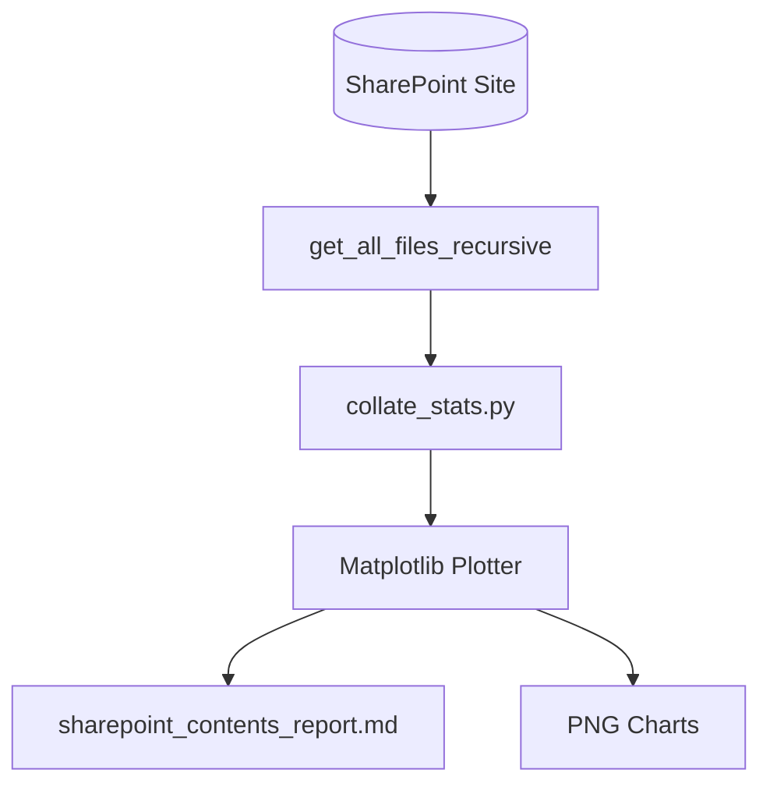

# 📊 SharePoint Sizing & Cleanliness Auditor

The statistics module crawls SharePoint recursively to generate a high-level, graphical dashboard auditing your files, data size, Purview security classifications, and file suffix distributions. This helps evaluate content volume and security configurations before connecting LLM assistants.

---

## 🏗️ System Flow



---

## 📁 Components

### 1. Audit Engine (`collate_stats.py`)
Traverses the site recursively and compiles:
*   **Sizing Sizing**: Total items, files count, folders count, total size, and average/median file sizes.
*   **Suffix Distribution**: Breakdown of suffixes (`.pdf`, `.xlsx`, `.docx`, `.pptx`, `.txt`, `.csv`, etc.) by count and percentage.
*   **Sensitivity Breakdown**: Quantifies unclassified files vs. Purview sensitivity labels (`General`, `Confidential`, `Highly Confidential`) and calculates the **encryption percentage** (RMS-protected files).
*   **Cleanliness Indicators**: Flags duplicate filenames, empty (0-byte) documents, and long path warnings exceeding 260 characters.

### 2. Graphical Plotter (Matplotlib Integration)
Automatically plots and generates **four high-resolution PNG distribution charts** saved to `/stats/`:
1.  `file_sizes_distribution.png`: Histogram of file capacities.
2.  `sensitivity_labels_distribution.png`: Horizontal bar chart of Purview labels.
3.  `file_types_distribution.png`: Pie chart of file extensions.
4.  `last_modified_distribution.png`: Bar chart timeline of last modified dates.

These graphs are embedded directly inside the detailed audit report **`stats/sharepoint_contents_report.md`**.

---

## 🤖 ADK Agent Integration

*   **`collate_stats.py`**: **Does NOT** use the ADK Agent. It is built as a system-level dashboard and auditing utility. It bypasses conversational agent flows and imports core REST API helpers (`sharepoint_client.py`) directly to recursively compile file sizes, extension mappings, and Purview labels. This ensures that you can audit your data footprint and security coverage before ever activating or configuring an LLM agent.

---

## 🚀 Execution Guide

Ensure your virtual environment is active:
```bash
source .venv/bin/activate
```

### Running the Sizing & Cleanliness Audit
To generate the graphical distribution charts and the cleanliness report:
```bash
python stats/collate_stats.py
```
*   *Output Report*: `stats/sharepoint_contents_report.md`
*   *Raw JSON Metrics*: `stats/sharepoint_contents_stats.json`
*   *PNG Chart Images*: `stats/*.png`
