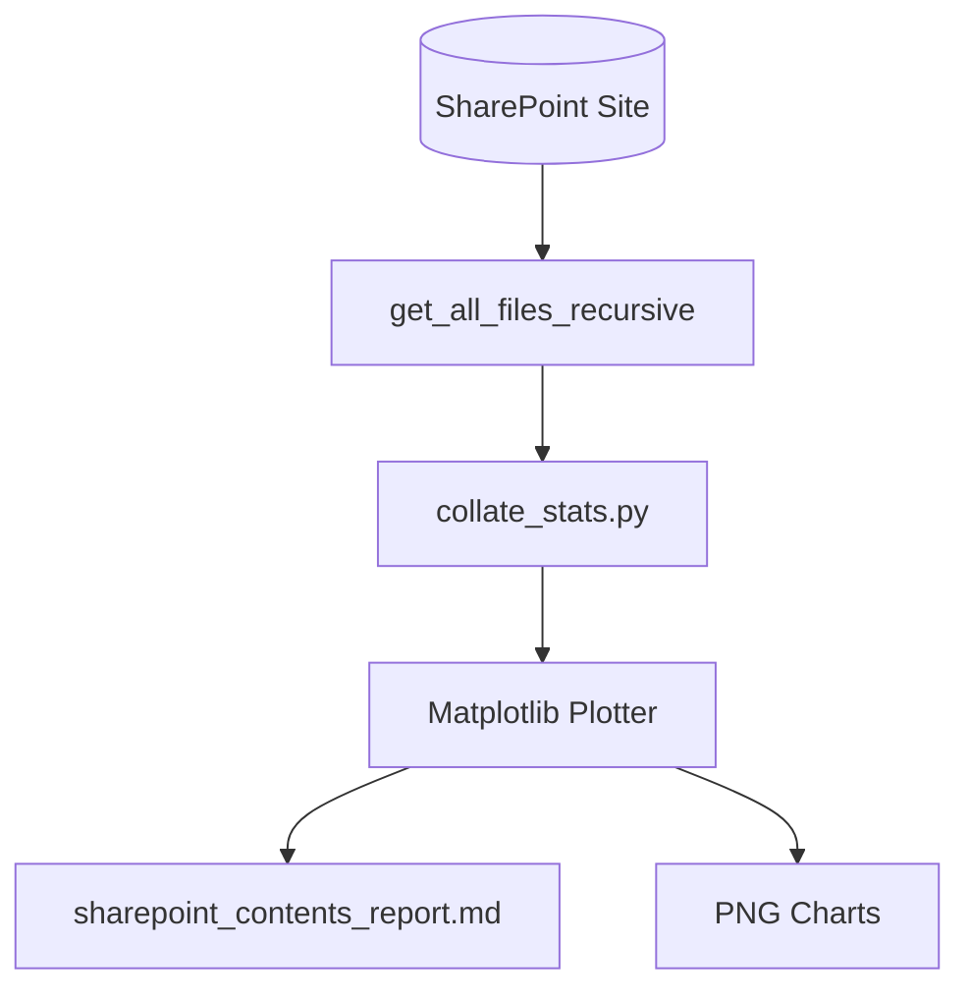

# 📊 SharePoint Sizing & Cleanliness Auditor

This tool scans your SharePoint site and creates a visual dashboard. It shows file sizes, sensitivity labels, and file type counts. This helps you check your data size and security labels before setting up an AI agent.

---

## 🏗️ System Flow



---

## 📁 Components

### 1. Audit Engine (`collate_stats.py`)
Scans your site recursively and counts:
*   **Sizes**: Total items, files count, folders count, total size, and average file size.
*   **File Types**: Breakdown of file extensions (`.pdf`, `.xlsx`, `.docx`, etc.) by count and percentage.
*   **Sensitivity Labels**: Finds how many files have Microsoft Purview labels (`General`, `Confidential`, `Highly Confidential`) and how many are locked (RMS-protected).
*   **Data Cleanliness**: Flags duplicate names, empty (0-byte) files, and very long paths (over 260 characters).

### 2. Graphical Charts (Matplotlib)
Automatically draws **four visual PNG charts** in `/stats/`:
1.  `file_sizes_distribution.png`: Chart showing file sizes.
2.  `sensitivity_labels_distribution.png`: Chart showing Purview labels.
3.  `file_types_distribution.png`: Chart showing file types.
4.  `last_modified_distribution.png`: Chart showing modification dates.

These charts are embedded directly inside the final audit report **`stats/sharepoint_contents_report.md`**.

---

## 🤖 ADK Agent Integration

*   **`collate_stats.py`**: **Does NOT** use the ADK Agent. It is built as a standalone tool. It talks directly to the SharePoint API using our Graph helper (`sharepoint_client.py`) to collect stats. This lets you audit your data footprint and security coverage before activating or configuring an AI agent.

---

## 🚀 Execution Guide

Make sure your virtual environment is active:
```bash
source .venv/bin/activate
```

### Run the Sizing & Cleanliness Audit
To generate the charts and the report:
```bash
python stats/collate_stats.py
```
*   *Output Report*: [stats/sharepoint_contents_report.md](file:///Users/weizhongt/coding/agentic-demos/sharepoint_eval/stats/sharepoint_contents_report.md)
*   *Raw JSON Stats*: `stats/sharepoint_contents_stats.json`
*   *PNG Chart Images*: `stats/*.png`
