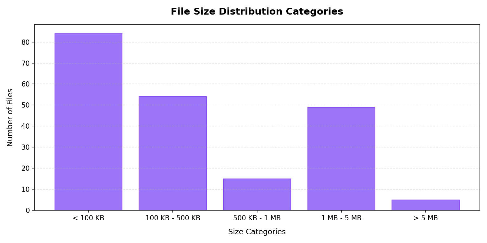
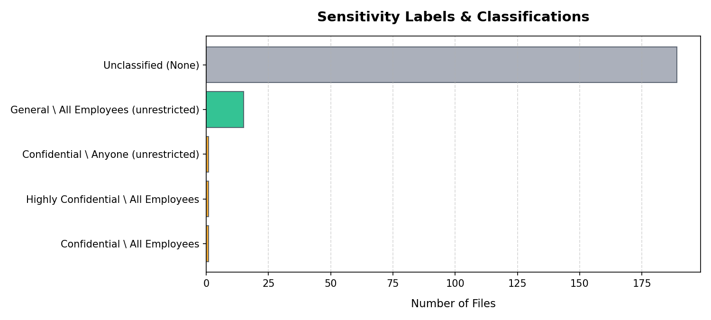
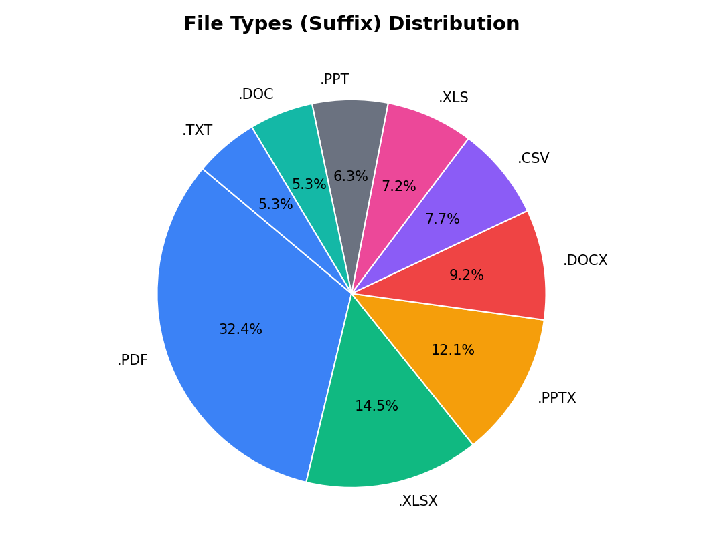
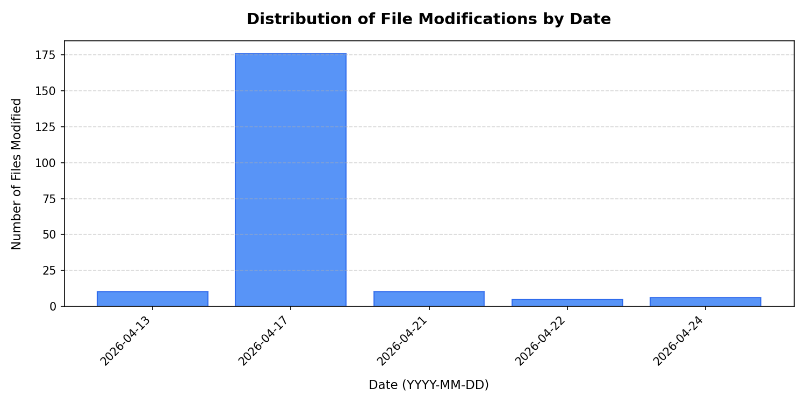

# 📊 SharePoint Contents & Cleanliness Analytics Report

Generated on: 2026-05-29 19:50:45 (UTC)

This report provides a high-level aggregate view of the documents stored inside your SharePoint site to help evaluate content sizing, migration completeness, and overall security alignment before connecting AI assistants.

## 📈 General Sizing Metrics

| Metric | Count / Value | Description |
| :--- | :--- | :--- |
| **Total Site Items** | 221 | Combined file and folder assets. |
| **Total Folders** | 14 📁 | Directory organization nodes. |
| **Total Files** | 207 📄 | Document content files. |
| **Combined Data Size** | `198.12 MB` 💾 | Aggregate bytes stored. |
| **Average File Size** | `980.05 KB` | Metric for context sizing estimates. |
| **Median File Size** | `202.00 KB` | Better indicator of typical file sizing. |
| **Max Folder Recursion Depth** | 3 | Sibling folder nesting depth. |

### 💾 Graphical Sizing Categories (File Sizes)

## 🔒 Security & Sensitivity Classifications

* **Total Encrypted (RMS-Protected) Files**: `18` (**8.70%** of all files) 🔒
  *Note: Encrypted Confidential files will trigger decryption constraints when directly downloaded as binary envelopes by custom text tools.*

### Sensitivity Label Breakdown:
- ⚪ **`Unclassified (None)`**: 189 files
- 🟢 **`General \ All Employees (unrestricted)`**: 15 files
- 🟡 **`Confidential \ All Employees`**: 1 files
- 🟡 **`Highly Confidential \ All Employees`**: 1 files
- 🟡 **`Confidential \ Anyone (unrestricted)`**: 1 files

### 🛡️ Graphical Sensitivity Classifications

## 📄 File Types & Suffix Distribution

| Suffix | Count | Percentage |
| :--- | :--- | :--- |
| **.PDF** | 67 | 32.4% |
| **.XLSX** | 30 | 14.5% |
| **.PPTX** | 25 | 12.1% |
| **.DOCX** | 19 | 9.2% |
| **.CSV** | 16 | 7.7% |
| **.XLS** | 15 | 7.2% |
| **.PPT** | 13 | 6.3% |
| **.DOC** | 11 | 5.3% |
| **.TXT** | 11 | 5.3% |

### 🍰 Graphical Suffix Breakdown

## 🧹 Data Cleanliness & Integrity Warnings

| Warning Indicator | Count | Status / Recommended Action |
| :--- | :--- | :--- |
| **Empty Files (0 Bytes)** | 0 | 🟢 Clean |
| **Long Path Warning** | 0 | 🟢 Safe |
| **Duplicate Filenames** | 0 | 🟢 Clean |

## 📅 Lifecycle Modifications

* **Oldest File Modified Timestamp**: `2026-04-13T07:29:27Z`
* **Newest File Modified Timestamp**: `2026-04-24T07:37:21Z`

### 📊 Graphical Timeline of File Modifications

